# Creature Luminose

Sedici creature bioluminescenti in due serie, modellate proceduralmente in
Blender con script Python: ogni forma, materiale, luce e animazione nasce dal
codice.

- **Serie 1 – Creature luminose** → [`blender/creature_luminose.py`](blender/creature_luminose.py)
- **Serie 2 – Creature del deserto** → [`blender/creature_deserto.py`](blender/creature_deserto.py)
  (vedi [più sotto](#serie-2--creature-luminose-del-deserto))

Tutte sono disponibili anche **per Roblox Studio**, con al massimo 20.000
triangoli per creatura: vedi [`roblox/LEGGIMI.md`](roblox/LEGGIMI.md).

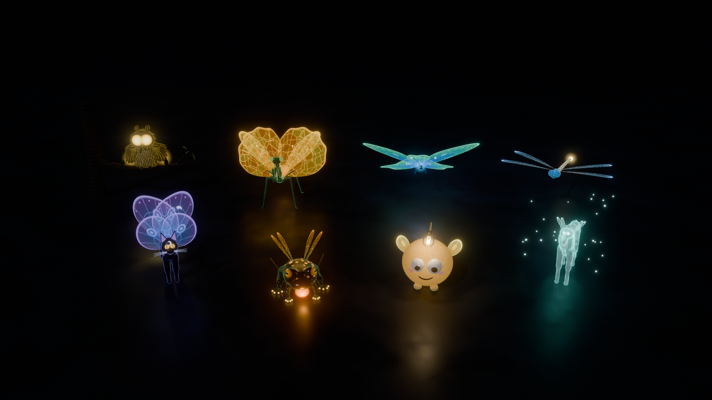
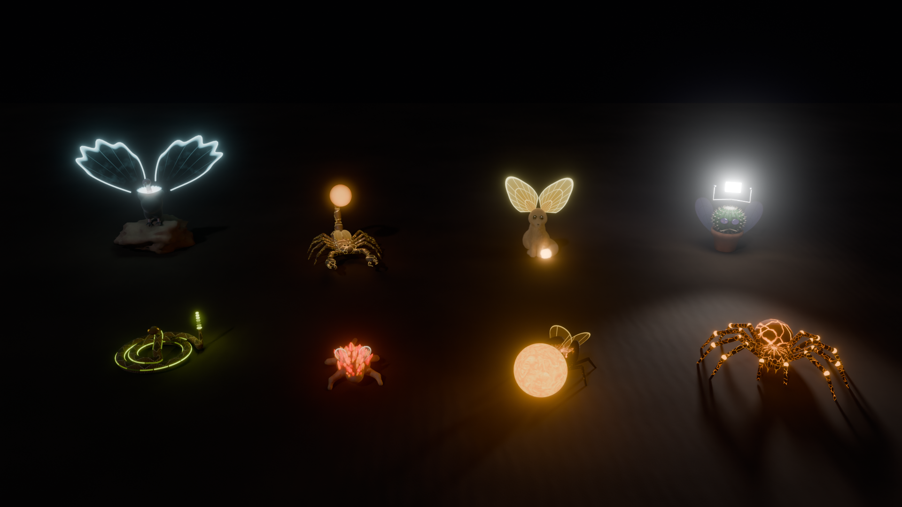

## Cosa c'è nel repository

| Cartella | Contenuto |
|---|---|
| `blender/creature_luminose.py` | Generatore della serie 1 (e infrastruttura comune: materiali, ali, luci, scena) |
| `blender/creature_deserto.py` | Generatore della serie del deserto (usa `creature_luminose.py`, che deve stare nella stessa cartella) |
| `blender/esporta_roblox.py` | Converte tutte le creature per Roblox (`.glb` + script Luau) |
| `modelli/*.blend`, `modelli/deserto/*.blend` | File Blender pronti da aprire: una scena per creatura + `00_tutte_le_creature.blend` |
| `anteprime/`, `anteprime/deserto/` | Render di anteprima (Cycles) |
| `roblox/` | Versione per **Roblox Studio**: file `.glb` + script Luau (vedi [`roblox/LEGGIMI.md`](roblox/LEGGIMI.md)) |

## Come aprirle

**Modo più semplice:** apri uno dei file in `modelli/` o `modelli/deserto/`
con Blender (4.2 o più recente). Il viewport parte in *Material Preview* con le luci della scena.
Per l'effetto completo premi `Z` e scegli **Rendered**, oppure `F12` per il
render finale. Premi `Spazio` per vedere le animazioni (pulsazioni, battito
d'ali, lampadina che dondola).

**Rigenerarle con lo script (in un file nuovo):**

1. Apri Blender e vai nel workspace **Scripting**.
2. *Text > Open...* e scegli `blender/creature_luminose.py`.
3. In cima al file scegli la creatura:
   ```python
   CREATURA = "tutte"   # oppure "mantide", "gatto", "gufo", "rana",
                        # "farfalla", "libellula", "lupo", "falena"
   ```
4. Premi **Run Script** (`Alt+P`).

Per la serie del deserto apri invece `blender/creature_deserto.py`, lasciando
`creature_luminose.py` nella stessa cartella, e scegli tra `"scorpione"`,
`"fennec"`, `"scarabeo"`, `"vipera"`, `"lucertola"`, `"avvoltoio"`,
`"tarantola"`, `"cactus"` oppure `"tutte"`.

> ⚠️ Con `PULISCI_SCENA = True` lo script **cancella la scena corrente** prima
> di costruire: usalo in un file nuovo.

**Da riga di comando** (salva il `.blend` e/o un render):

```bash
blender --background --python blender/creature_luminose.py -- \
        --creatura gufo --salva gufo.blend --render gufo.png \
        --campioni 64 --risoluzione 1280x720
```

## Su Roblox Studio

Nella cartella [`roblox/`](roblox/LEGGIMI.md) ci sono tutte le 16 creature
convertite per Roblox, **ognuna con al massimo 20.000 triangoli in totale**:
un file `.glb` per creatura (`roblox/modelli/` e `roblox/modelli/deserto/`), da
importare con *Import 3D* (con **Anchored** attivo), e un unico script
`CreatureLuminose.client.lua`, da incollare in un LocalScript in
*StarterPlayerScripts*. Lo script accende Neon, luci e faretti e anima ali,
code, lampadina, sfera di magma, sacca vocale e lucciole. Le istruzioni
complete sono in [`roblox/LEGGIMI.md`](roblox/LEGGIMI.md).

## Parametri regolabili (in cima allo script)

| Parametro | Effetto |
|---|---|
| `CREATURA` | Quale creatura costruire, oppure `"tutte"` |
| `MOTORE` | `"EEVEE"` (veloce, ottimo nel viewport) o `"CYCLES"` (più realistico) |
| `INTENSITA_LUCE` | Moltiplica tutte le emissioni e le luci delle creature (es. `1.5` = più abbaglianti, `0.6` = più soffuse) |
| `ANIM_FRAMES` | Durata del ciclo di animazione (ogni pulsazione si ripete perfettamente) |
| `PULISCI_SCENA` | Svuota la scena prima di costruire |

Ogni creatura è in una sua **collezione** (`01_Mante-Luce`, `02_Gattoluna`, …)
con un empty `…_Radice` a cui è tutto imparentato: sposta o scala la radice per
muovere l'intera creatura. I materiali hanno nomi parlanti (es.
`Mantide_Ala_Vetrata`, `Rana_Sacca_Vocale`): nello **Shader Editor** trovi i
nodi con colori e intensità da ritoccare.

## Le creature

### 01 · Mante-Luce
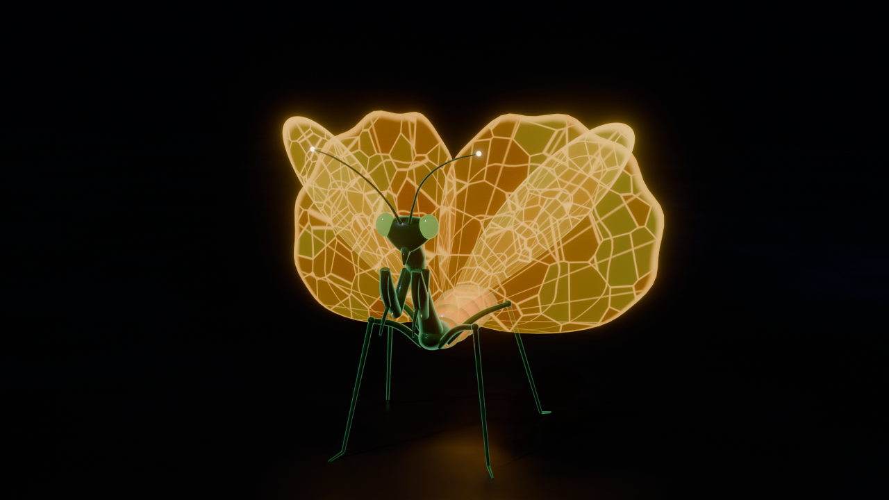

Mantide smeraldo in posa "di parata" con due paia di ali spiegate a ventaglio.
Le ali sono **vetrate**: pannelli arancio-oro semitrasparenti (celle Voronoi con
colore casuale per pannello), venature dorate luminose radiali e trasversali,
bordo acceso. L'addome segmentato **pulsa** di luce calda (emissione con
driver + luce puntiforme interna). Zampe raptatorie con file di spine dalle
punte dorate, occhi composti, antenne con punte luminose.

### 02 · Gattoluna
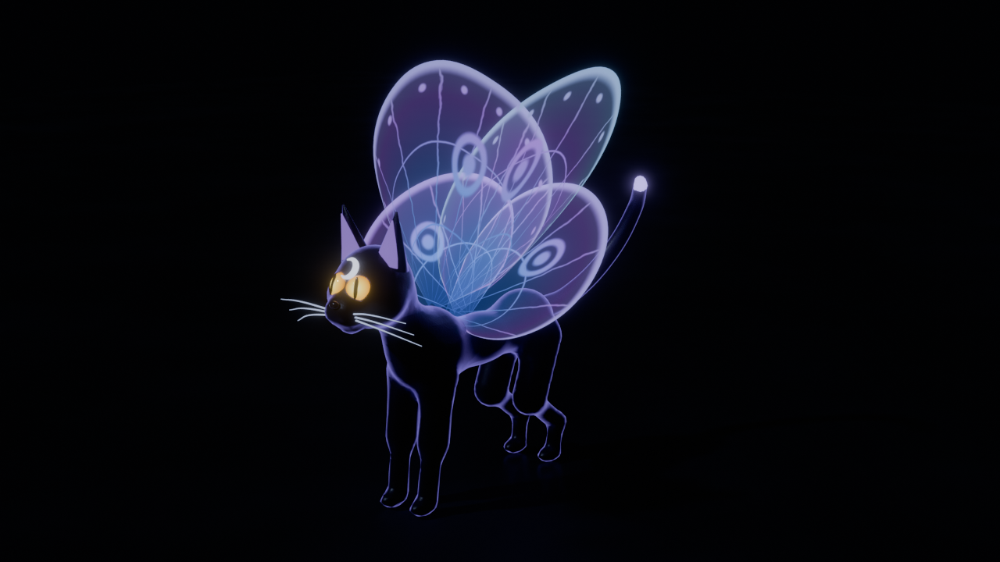

Gatto nero snello (corpo organico da metaball) con riflessi viola-blu (sheen +
bagliore sui contorni). Ali da falena fatte di **pura luce**: nessuna superficie
opaca, solo emissione blu-viola iridescente che cambia colore con l'angolo di
vista, con venature, ocelli e puntini sul bordo. Occhi dorati luminosi con
pupilla a fessura e cornea lucida, orecchie con interno luminoso, baffi e punta
della coda che brillano, falce di luna sulla fronte.

### 03 · Gufo-Scintilla
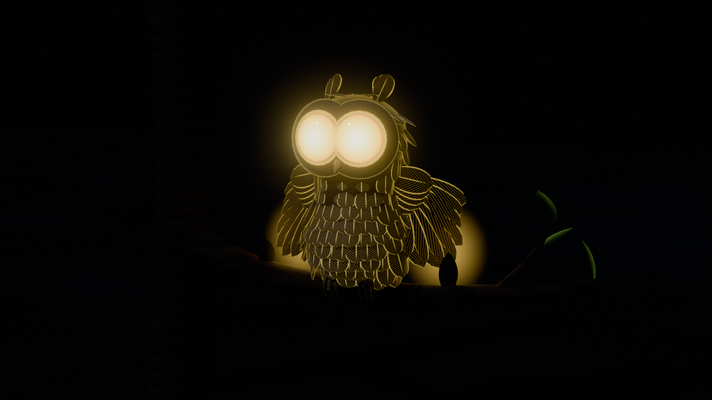

Piccolo gufo stilizzato su un ramo. Circa 300 **piume modellate una a una**
e posizionate sulla superficie del corpo (raycast), ognuna con bordo, rachide
e barbe al neon giallo-oro sul marrone. Occhi enormi a **faro** (gradiente
radiale bianco-oro, due luci spot che proiettano davvero luce in avanti). Ali
semiaperte a ventaglio con un'**aura volumetrica** pulsante sulle punte.

### 04 · Ranabuio
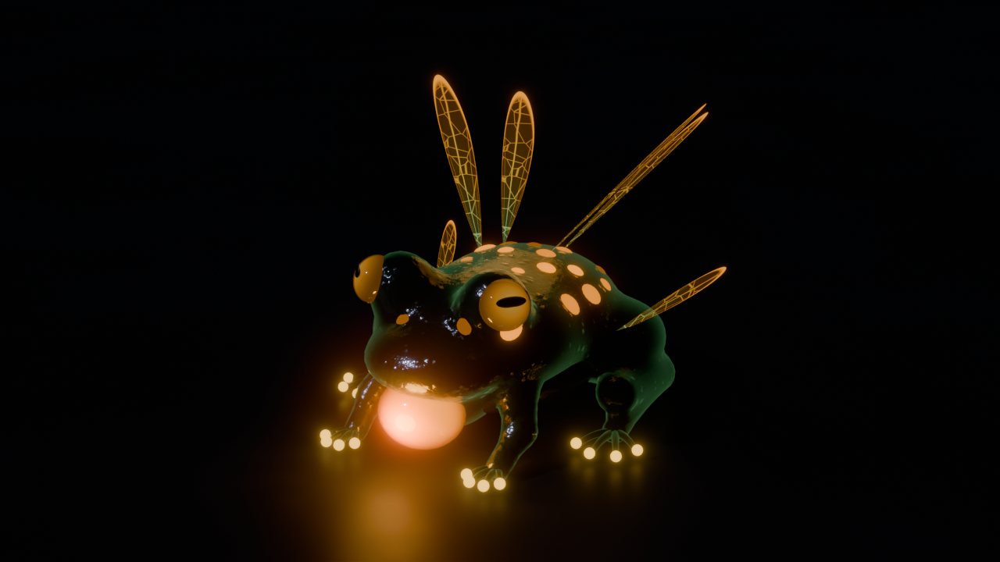

Rana tarchiata con pelle verde bosco **bagnata** (clearcoat quasi a specchio,
verruche in rilievo, chiazze). **Sacca vocale** arancione traslucida che si
gonfia e pulsa, punti luminosi su dorso e fianchi che pulsano sfasati tra loro,
bulbilli luminosi sulle dita. Ali da insetto trasparenti sul dorso e sui
fianchi che vibrano.

### 05 · Farfalla-Glow
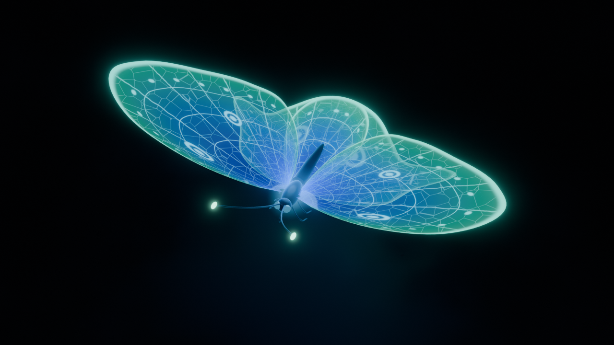

Grande farfalla dal corpo scuro e sottile. Ali imponenti con **pattern
intricato**: venature radiali e trasversali, fitta rete di cellette, fila di
puntini sul margine, ocelli, bordo smeraldo; il colore va dallo zaffiro allo
smeraldo e cambia con l'angolo di vista. Bagliore pulsante al centro del corpo,
antenne lunghe con punte luminose, proboscide arrotolata, battito d'ali lento.

### 06 · Libellula-Fulmine
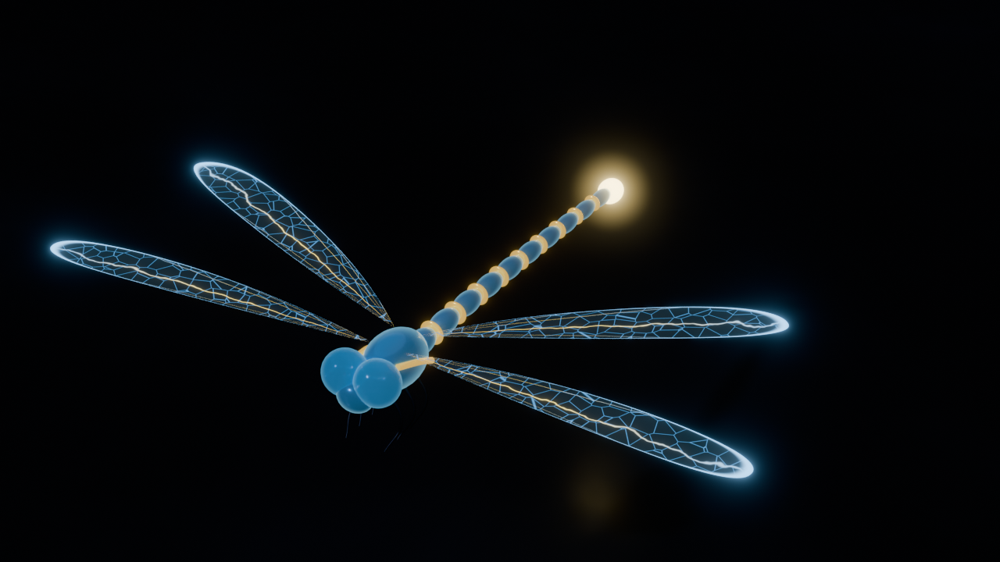

Libellula azzurro-oro con addome segmentato ad anelli dorati e **bulbo
luminoso** pulsante in coda. Quattro ali quasi invisibili: la membrana è
trasparente, ma la rete di celle brilla di **blu come un circuito stampato** e
le venature principali sono **fulmini d'oro** ondulati; bordo blu e pterostigma
dorato. Le ali vibrano velocemente.

### 07 · Lupo-Luce
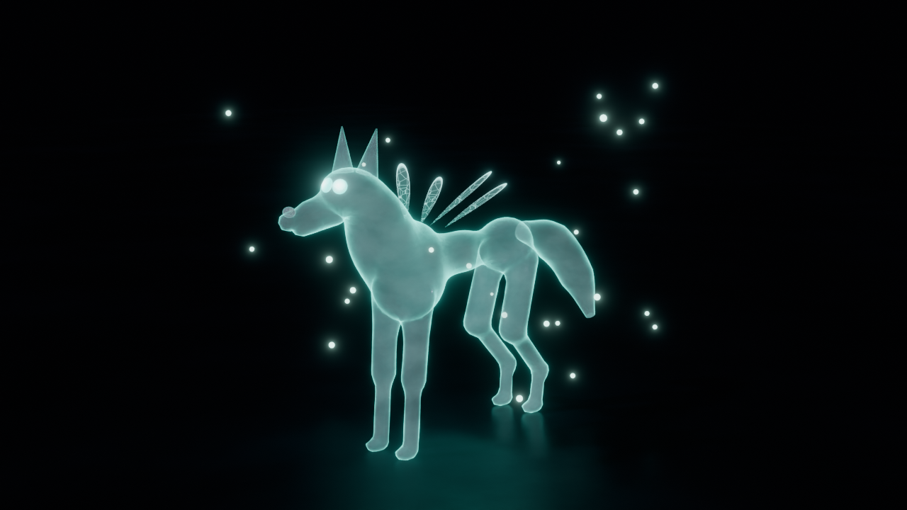

Lupo etereo **semitrasparente** bianco-argento: il corpo lascia intravedere lo
sfondo, i contorni si accendono di **turchese** e tutta la creatura pulsa
lentamente (con venature di luce che scorrono nel "pelo"). Occhi luminosi,
minuscole ali da insetto sulla schiena, lucciole che fluttuano intorno.

### 08 · La Piccola Lucina Farfallina (The Brainrot Moth)
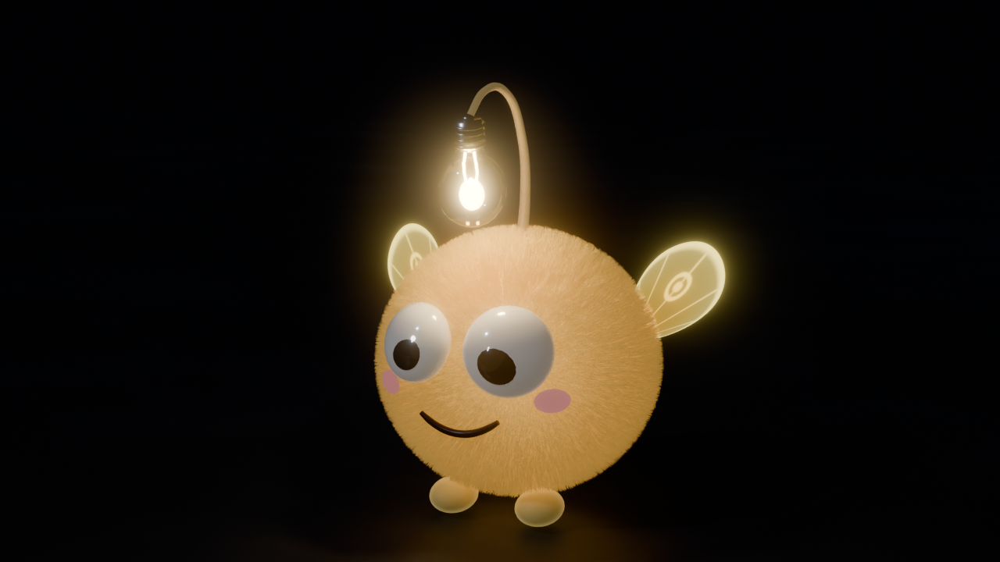

Polpetta **pelosa** (vero pelo con sistema particellare hair) giallo caldo, occhioni
"ninnolo" con pupille storte e luccichio, guance rosa e sorriso innocente.
Alette minuscole luminosissime che sbattono all'impazzata. Sopra la testa
un'antenna flessibile che ondeggia e da cui **penzola una vera lampadina accesa**
(attacco a vite, vetro, filamento incandescente, luce calda) che dondola.

## Serie 2 · Creature luminose del deserto

Generate da [`blender/creature_deserto.py`](blender/creature_deserto.py), su
una sabbia notturna con le increspature del vento.

### 01 · Scorpione-Lanterna
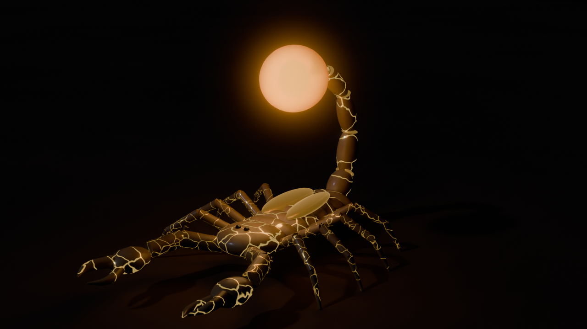

Scorpione tozzo con corazza color sabbia attraversata da **venature d'oro**
metalliche e leggermente luminose. La coda si arcua sopra il dorso e finisce in
un enorme **bulbo-lanterna** di materiale organico traslucido (subsurface
scattering, superficie smerigliata) con una fiamma emissiva potentissima
all'interno: pulsa di luce ambrata come una lanterna a olio e fa ondeggiare la
coda. Chele massicce e piccole elitre da coleottero ripiegate sul dorso.

### 02 · Fennec-Solare
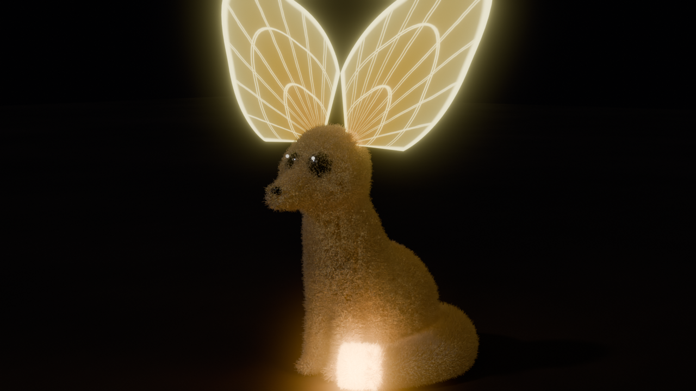

Piccola volpe del deserto con **vero pelo** (sistema particellare, anche sulla
coda). Le orecchie gigantesche sono **ali spesse di luce solare**:
semitrasparenti, con venature di un giallo accecante, e si muovono appena. La
punta della coda vaporosa ha un bagliore caldo.

### 03 · Scarabeo-Fornace
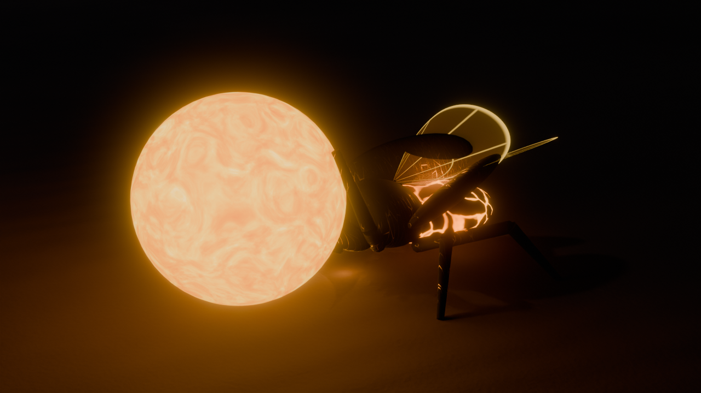

Scarabeo sacro **nero opaco con graffi d'oro** (guscio ruvido e un po'
metallico). Le elitre aperte rivelano un addome che brucia come carboni ardenti
(crepe di lava). Spinge una **sfera perfetta di magma luminoso** che rotola e lo
illumina dal basso.

### 04 · Vipera-Sonaglio Luminoso
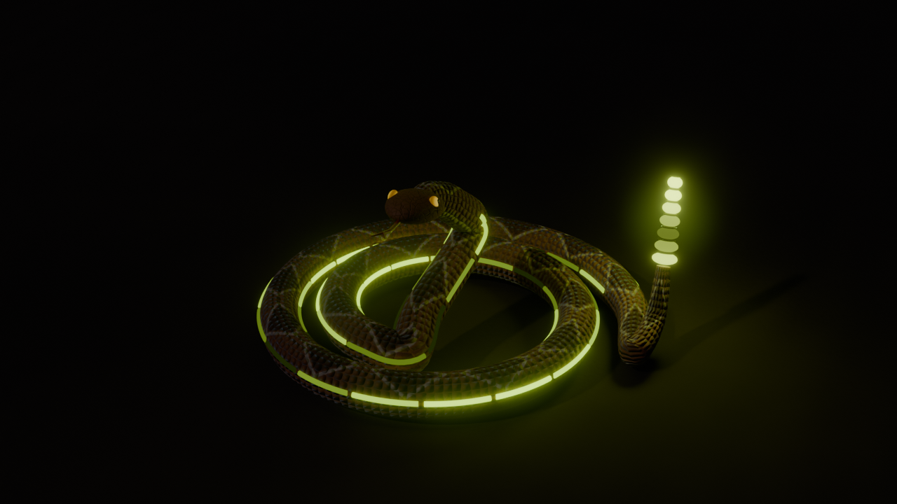

Serpente avvolto a spirale con **squame in rilievo** color terracotta, rombi
dorsali e ventre chiaro (diventano una normal map per Roblox). Il sonaglio è una
fila di **anelli di lucciola verde-giallo** che si accendono uno dopo l'altro, e
lungo i fianchi corrono strisce sottili che si illuminano **in sequenza verso la
coda**, come una barra di caricamento. La lingua biforcuta guizza.

### 05 · Lucertola-Cristallo
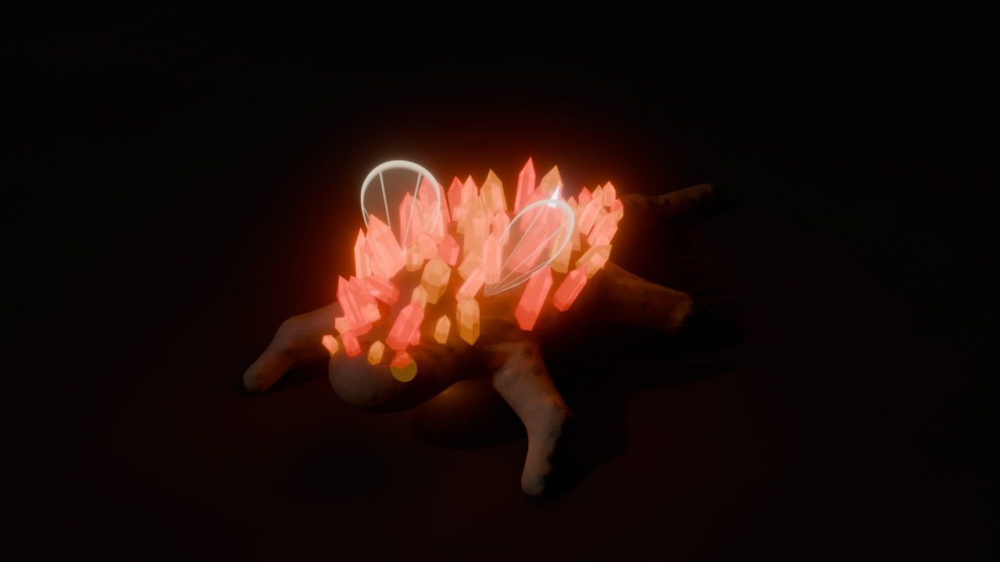

Diavolo spinoso dalla pelle mimetica e verrucosa. Le spine sono **cristalli di
quarzo grezzo** trasparenti (Transmission) con la brace accesa dentro: rossi,
rosso-arancio e arancioni, ognuno pulsa con un ritmo diverso. Due minuscole
alucce trasparenti sulle spalle battono velocissime.

### 06 · Avvoltoio-Miraggio
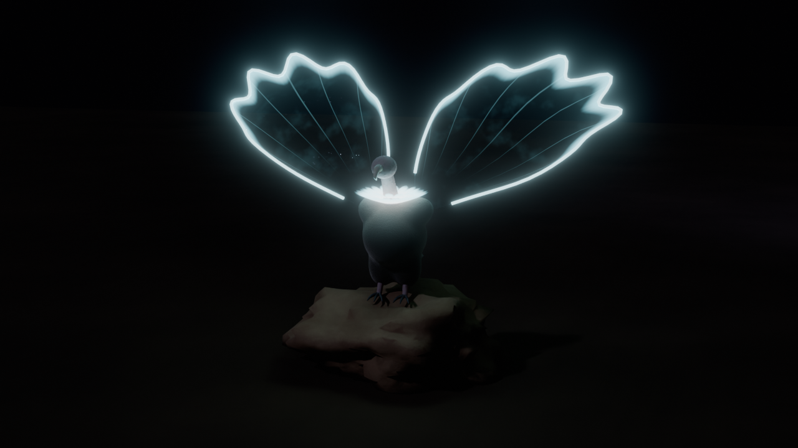

Piccolo avvoltoio appollaiato su una roccia, testa e collo nudi e becco
uncinato. Il collare è fatto di **piume di luce bianca e azzurro-oasi** che
pulsano. Le ali sono immense, ondulate e quasi invisibili: un vetro deformato da
un **rumore animato che imita il tremolio dell'aria calda**, incorniciato da
bordi luminosi.

### 07 · Tarantola-Brace
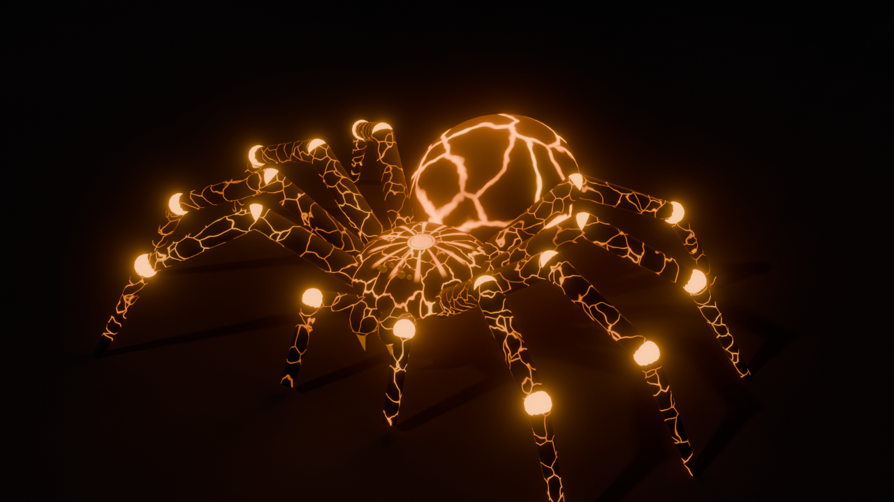

Tarantola massiccia con una crosta scura spaccata da **crepe di lava** (maschera
Voronoi) che rivelano l'arancione incandescente sotto. Le articolazioni delle
otto zampe sono giunture di lava e sulla schiena c'è un **sole stilizzato**
luminoso.

### 08 · Il Cactus "Chill Guy" (The Brainrot Desert Moth)
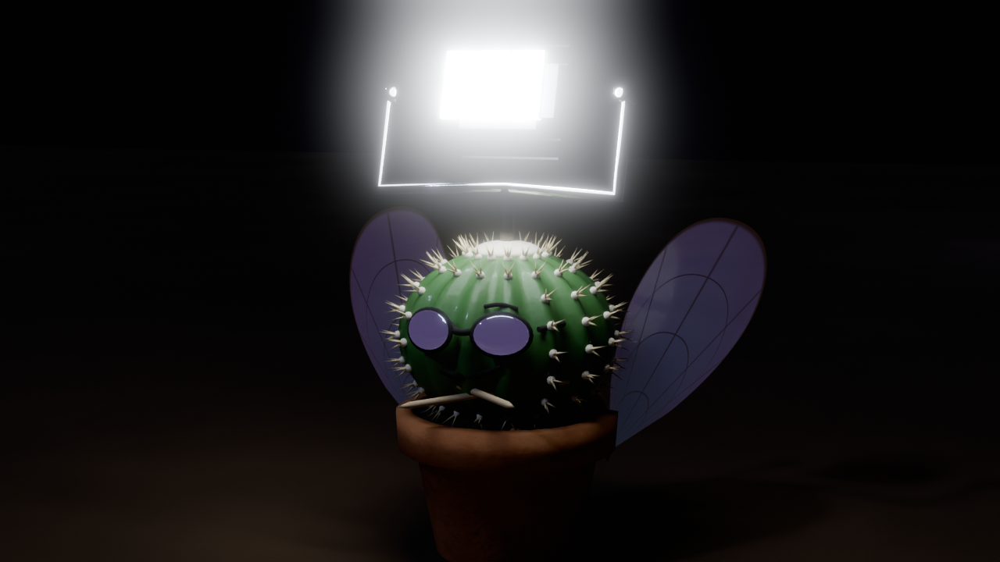

Cactus a palla con costole e spine, piantato in un vasetto di terracotta
**sbeccato**. Ha una faccia piatta da decalcomania con **occhiali da sole a
specchio** e un sorrisetto rilassato, braccine-stuzzicadenti conserte e due
**ali da mosca sovradimensionate** attaccate al vaso che sbattono all'impazzata.
Al posto del fiore, in testa, un **faretto alogeno da stadio** con griglia e
alette di raffreddamento: emissione al massimo e un vero faretto (spot) che
"brucia" l'immagine.

## Dettagli tecnici

- **Emissione e trasparenza**: le ali usano un unico shader procedurale
  (`m_wing`) basato sulle UV del ventaglio (u = lungo il bordo, v = dalla base
  al bordo), quindi venature, bordi, celle, ocelli e puntini sono tutti
  regolabili da codice senza texture esterne.
- **Bagliore (bloom)**: un nodo *Glare* in compositing (e il bloom di EEVEE
  sulle versioni che lo hanno) fa "accendere" le parti luminose.
- **Animazioni**: sono fatte con driver semplici (`sin(frame)`), che Blender
  valuta anche senza abilitare l'esecuzione automatica degli script.
- **Compatibilità**: lo script è stato eseguito e renderizzato con
  **Blender 4.2 LTS** e **Blender 5.0**, in Cycles e in EEVEE. Le API che
  cambiano tra le versioni (nomi del Principled BSDF, EEVEE Next, compositor
  5.x) sono gestite. I file in `modelli/` sono salvati con la 4.2 e si aprono
  anche nella 5.0. Sulle versioni 3.x non è stato provato.
- **Prestazioni**: la scena `tutte` della prima serie ha 19 luci, ~300 piume e
  il pelo della Lucina; quella del deserto ha il pelo del fennec e le ali in
  vetro dell'avvoltoio. In EEVEE restano fluide su una GPU recente. Se il
  viewport rallenta, nascondi le collezioni che non ti servono.
- **Versione Roblox**: `esporta_roblox.py` ricostruisce ogni creatura con un
  livello di dettaglio più basso (`DETTAGLIO`) finché sta sotto i 20.000
  triangoli, cuoce i materiali in texture e genera lo script Luau. Le versioni
  Blender restano a dettaglio pieno.
