# Creature Luminose

Sessantaquattro creature bioluminescenti in otto serie, modellate
proceduralmente in Blender con script Python: ogni forma, materiale, luce e
animazione nasce dal codice. Le serie dalla 5 in poi sono modelli statici
(senza animazioni) con il setup EEVEE Next richiesto.

- **Serie 1 – Creature luminose** → [`blender/creature_luminose.py`](blender/creature_luminose.py)
- **Serie 2 – Creature del deserto** → [`blender/creature_deserto.py`](blender/creature_deserto.py)
  (vedi [più sotto](#serie-2--creature-luminose-del-deserto))
- **Serie 3 – Creature della neve** → [`blender/creature_neve.py`](blender/creature_neve.py)
  (vedi [più sotto](#serie-3--creature-luminose-della-neve))
- **Serie 4 – Creature dell'oceano** → [`blender/creature_oceano.py`](blender/creature_oceano.py)
  (vedi [più sotto](#serie-4--creature-luminose-delloceano))
- **Serie 5 – I mostri** → [`blender/creature_mostri.py`](blender/creature_mostri.py)
  (vedi [più sotto](#serie-5--i-mostri))
- **Serie 6 – Creature dell'inferno** → [`blender/creature_inferno.py`](blender/creature_inferno.py)
  (vedi [più sotto](#serie-6--creature-luminose-dellinferno))
- **Serie 7 – Gli angeli** → [`blender/creature_angeli.py`](blender/creature_angeli.py)
  (vedi [più sotto](#serie-7--gli-angeli))
- **Serie 8 – I draghi** → [`blender/creature_draghi.py`](blender/creature_draghi.py)
  (vedi [più sotto](#serie-8--i-draghi))

Tutte sono disponibili anche **per Roblox Studio**, con al massimo 20.000
triangoli per creatura: vedi [`roblox/LEGGIMI.md`](roblox/LEGGIMI.md).


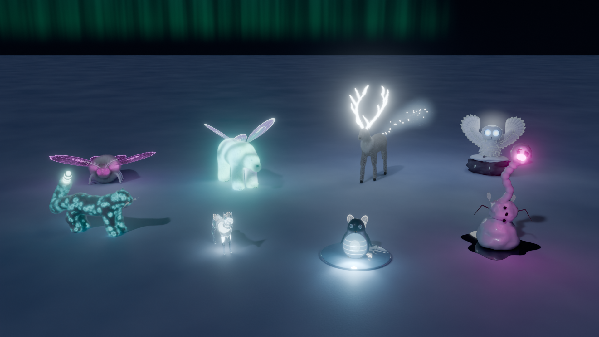
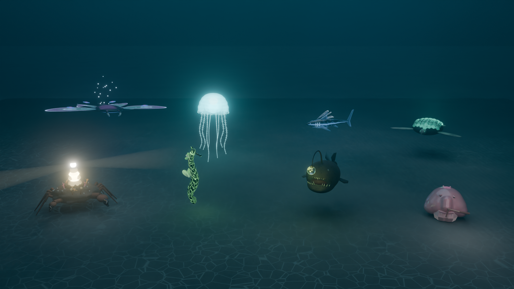
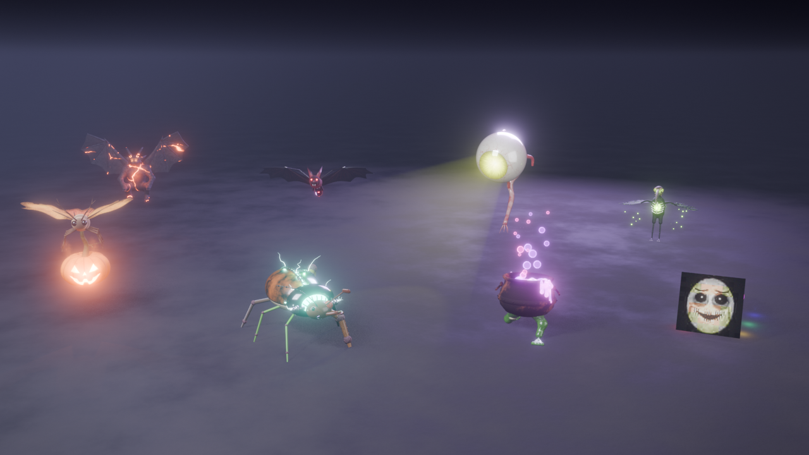
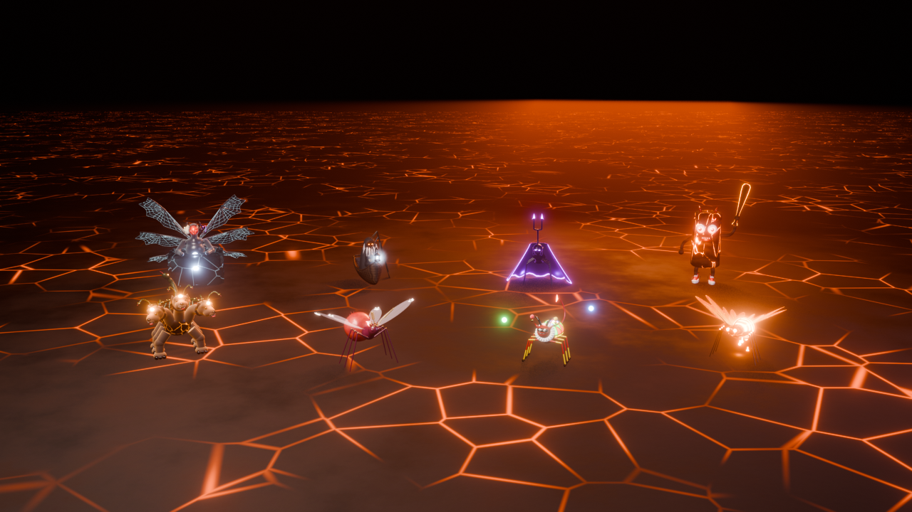
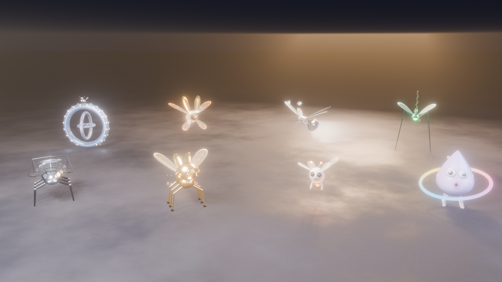
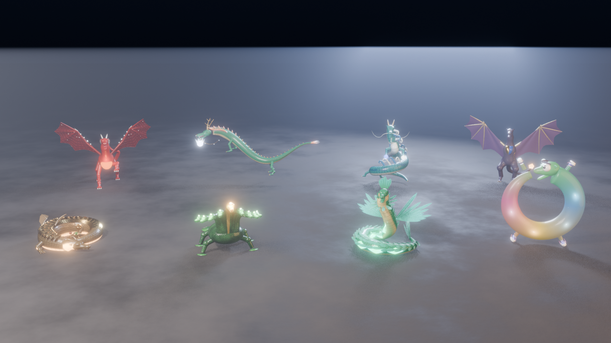

## Cosa c'è nel repository

| Cartella | Contenuto |
|---|---|
| `blender/creature_luminose.py` | Generatore della serie 1 (e infrastruttura comune: materiali, ali, luci, scena) |
| `blender/creature_deserto.py` | Generatore della serie del deserto (usa `creature_luminose.py`, che deve stare nella stessa cartella) |
| `blender/creature_neve.py` | Generatore della serie della neve (usa i due file precedenti) |
| `blender/creature_oceano.py` | Generatore della serie dell'oceano (usa i tre file precedenti) |
| `blender/creature_strumenti.py` | Strumenti comuni alle serie 5-8: setup EEVEE Next, Blackbody, luci proxy Child Of, ali con Thin Film, occhi da cartone, sneakers, ali membranose |
| `blender/creature_mostri.py` | Generatore della serie 5 (usa `creature_strumenti.py` e i file precedenti) |
| `blender/creature_inferno.py` | Generatore della serie 6 (usa `creature_strumenti.py` e i file precedenti) |
| `blender/creature_angeli.py` | Generatore della serie 7 (usa `creature_strumenti.py` e i file precedenti) |
| `blender/creature_draghi.py` | Generatore della serie 8 (usa `creature_strumenti.py` e i file precedenti) |
| `blender/esporta_roblox.py` | Converte tutte le creature per Roblox (`.glb` + script Luau) |
| `modelli/…/*.blend` | File Blender pronti da aprire (`modelli/`, `modelli/deserto/`, `modelli/neve/`, `modelli/oceano/`, `modelli/mostri/`, `modelli/inferno/`, `modelli/angeli/`, `modelli/draghi/`): una scena per creatura + `00_tutte_le_creature.blend` |
| `anteprime/…` | Render di anteprima (Cycles per le serie 1-4, EEVEE Next per le serie 5-8), con le stesse sottocartelle |
| `roblox/` | Versione per **Roblox Studio**: file `.glb` + script Luau (vedi [`roblox/LEGGIMI.md`](roblox/LEGGIMI.md)) |

## Come aprirle

**Modo più semplice:** apri uno dei file in `modelli/` (o nelle sottocartelle
`deserto/`, `neve/`, `oceano/`) con Blender (4.2 o più recente). Il viewport parte in *Material Preview* con le luci della scena.
Per l'effetto completo premi `Z` e scegli **Rendered**, oppure `F12` per il
render finale. Premi `Spazio` per vedere le animazioni (pulsazioni, battito
d'ali, lampadina che dondola).

**Rigenerarle con lo script (in un file nuovo):**

1. Apri Blender e vai nel workspace **Scripting**.
2. *Text > Open...* e scegli `blender/creature_luminose.py`.
3. In cima al file scegli la creatura:
   ```python
   CREATURA = "tutte"   # oppure "mantide", "gatto", "gufo", "rana",
                        # "farfalla", "libellula", "lupo", "falena"
   ```
4. Premi **Run Script** (`Alt+P`).

Per le altre serie apri il loro file, lasciando tutti gli script nella stessa
cartella (ognuno usa quelli delle serie precedenti), e scegli la creatura:

| File | Creature |
|---|---|
| `creature_deserto.py` | `"scorpione"`, `"fennec"`, `"scarabeo"`, `"vipera"`, `"lucertola"`, `"avvoltoio"`, `"tarantola"`, `"cactus"` |
| `creature_neve.py` | `"orso"`, `"pinguino"`, `"renna"`, `"volpe"`, `"leopardo"`, `"yeti"`, `"civetta"`, `"pupazzo"` |
| `creature_oceano.py` | `"medusa"`, `"cavalluccio"`, `"granchio"`, `"manta"`, `"squalo"`, `"tartaruga"`, `"pescatrice"`, `"blobfish"` |
| `creature_mostri.py` | `"pipistrello"`, `"scarabeo"`, `"gargoyle"`, `"zucca"`, `"corvo"`, `"occhio"`, `"calderone"`, `"verme"` |
| `creature_inferno.py` | `"cerbero"`, `"caronte"`, `"ade"`, `"persefone"`, `"alichino"`, `"ghiacciolo"`, `"flegetonte"`, `"tungtung"` |
| `creature_angeli.py` | `"serafino"`, `"cherubino"`, `"ofanim"`, `"michele"`, `"gabriele"`, `"raffaele"`, `"custode"`, `"halolo"` |
| `creature_draghi.py` | `"tesorino"`, `"long"`, `"ryujin"`, `"quetzal"`, `"ddraig"`, `"idra"`, `"wyvern"`, `"ourobo"` |

(oppure `"tutte"` per la scena con le otto creature della serie).

> ⚠️ Con `PULISCI_SCENA = True` lo script **cancella la scena corrente** prima
> di costruire: usalo in un file nuovo.

**Da riga di comando** (salva il `.blend` e/o un render):

```bash
blender --background --python blender/creature_luminose.py -- \
        --creatura gufo --salva gufo.blend --render gufo.png \
        --campioni 64 --risoluzione 1280x720
```

## Su Roblox Studio

Nella cartella [`roblox/`](roblox/LEGGIMI.md) ci sono tutte le 64 creature
convertite per Roblox, **ognuna con al massimo 20.000 triangoli in totale**:
un file `.glb` per creatura (`roblox/modelli/` e le sottocartelle `deserto/`,
`neve/`, `oceano/`), da importare con *Import 3D* (con **Anchored** attivo), e
un unico script `CreatureLuminose.client.lua`, da incollare in un LocalScript
in *StarterPlayerScripts*. Lo script accende Neon, luci e faretti, fa scorrere
i colori (naso LED, aurora), fa galleggiare le creature marine e anima ali,
code, colli, antenne e fari. Le istruzioni complete sono in
[`roblox/LEGGIMI.md`](roblox/LEGGIMI.md).

## Parametri regolabili (in cima allo script)

| Parametro | Effetto |
|---|---|
| `CREATURA` | Quale creatura costruire, oppure `"tutte"` |
| `MOTORE` | `"EEVEE"` (veloce, ottimo nel viewport) o `"CYCLES"` (più realistico) |
| `INTENSITA_LUCE` | Moltiplica tutte le emissioni e le luci delle creature (es. `1.5` = più abbaglianti, `0.6` = più soffuse) |
| `ANIM_FRAMES` | Durata del ciclo di animazione (ogni pulsazione si ripete perfettamente) |
| `PULISCI_SCENA` | Svuota la scena prima di costruire |
| `FOSCHIA` (solo oceano) | Acqua con un velo di foschia: rende visibili i fasci di luce, ma rallenta il render |

Ogni creatura è in una sua **collezione** (`01_Mante-Luce`, `02_Gattoluna`, …)
con un empty `…_Radice` a cui è tutto imparentato: sposta o scala la radice per
muovere l'intera creatura. I materiali hanno nomi parlanti (es.
`Mantide_Ala_Vetrata`, `Rana_Sacca_Vocale`): nello **Shader Editor** trovi i
nodi con colori e intensità da ritoccare.

## Le creature

### 01 · Mante-Luce


Mantide smeraldo in posa "di parata" con due paia di ali spiegate a ventaglio.
Le ali sono **vetrate**: pannelli arancio-oro semitrasparenti (celle Voronoi con
colore casuale per pannello), venature dorate luminose radiali e trasversali,
bordo acceso. L'addome segmentato **pulsa** di luce calda (emissione con
driver + luce puntiforme interna). Zampe raptatorie con file di spine dalle
punte dorate, occhi composti, antenne con punte luminose.

### 02 · Gattoluna


Gatto nero snello (corpo organico da metaball) con riflessi viola-blu (sheen +
bagliore sui contorni). Ali da falena fatte di **pura luce**: nessuna superficie
opaca, solo emissione blu-viola iridescente che cambia colore con l'angolo di
vista, con venature, ocelli e puntini sul bordo. Occhi dorati luminosi con
pupilla a fessura e cornea lucida, orecchie con interno luminoso, baffi e punta
della coda che brillano, falce di luna sulla fronte.

### 03 · Gufo-Scintilla


Piccolo gufo stilizzato su un ramo. Circa 300 **piume modellate una a una**
e posizionate sulla superficie del corpo (raycast), ognuna con bordo, rachide
e barbe al neon giallo-oro sul marrone. Occhi enormi a **faro** (gradiente
radiale bianco-oro, due luci spot che proiettano davvero luce in avanti). Ali
semiaperte a ventaglio con un'**aura volumetrica** pulsante sulle punte.

### 04 · Ranabuio


Rana tarchiata con pelle verde bosco **bagnata** (clearcoat quasi a specchio,
verruche in rilievo, chiazze). **Sacca vocale** arancione traslucida che si
gonfia e pulsa, punti luminosi su dorso e fianchi che pulsano sfasati tra loro,
bulbilli luminosi sulle dita. Ali da insetto trasparenti sul dorso e sui
fianchi che vibrano.

### 05 · Farfalla-Glow


Grande farfalla dal corpo scuro e sottile. Ali imponenti con **pattern
intricato**: venature radiali e trasversali, fitta rete di cellette, fila di
puntini sul margine, ocelli, bordo smeraldo; il colore va dallo zaffiro allo
smeraldo e cambia con l'angolo di vista. Bagliore pulsante al centro del corpo,
antenne lunghe con punte luminose, proboscide arrotolata, battito d'ali lento.

### 06 · Libellula-Fulmine


Libellula azzurro-oro con addome segmentato ad anelli dorati e **bulbo
luminoso** pulsante in coda. Quattro ali quasi invisibili: la membrana è
trasparente, ma la rete di celle brilla di **blu come un circuito stampato** e
le venature principali sono **fulmini d'oro** ondulati; bordo blu e pterostigma
dorato. Le ali vibrano velocemente.

### 07 · Lupo-Luce


Lupo etereo **semitrasparente** bianco-argento: il corpo lascia intravedere lo
sfondo, i contorni si accendono di **turchese** e tutta la creatura pulsa
lentamente (con venature di luce che scorrono nel "pelo"). Occhi luminosi,
minuscole ali da insetto sulla schiena, lucciole che fluttuano intorno.

### 08 · La Piccola Lucina Farfallina (The Brainrot Moth)


Polpetta **pelosa** (vero pelo con sistema particellare hair) giallo caldo, occhioni
"ninnolo" con pupille storte e luccichio, guance rosa e sorriso innocente.
Alette minuscole luminosissime che sbattono all'impazzata. Sopra la testa
un'antenna flessibile che ondeggia e da cui **penzola una vera lampadina accesa**
(attacco a vite, vetro, filamento incandescente, luce calda) che dondola.

## Serie 2 · Creature luminose del deserto

Generate da [`blender/creature_deserto.py`](blender/creature_deserto.py), su
una sabbia notturna con le increspature del vento.

### 01 · Scorpione-Lanterna


Scorpione tozzo con corazza color sabbia attraversata da **venature d'oro**
metalliche e leggermente luminose. La coda si arcua sopra il dorso e finisce in
un enorme **bulbo-lanterna** di materiale organico traslucido (subsurface
scattering, superficie smerigliata) con una fiamma emissiva potentissima
all'interno: pulsa di luce ambrata come una lanterna a olio e fa ondeggiare la
coda. Chele massicce e piccole elitre da coleottero ripiegate sul dorso.

### 02 · Fennec-Solare


Piccola volpe del deserto con **vero pelo** (sistema particellare, anche sulla
coda). Le orecchie gigantesche sono **ali spesse di luce solare**:
semitrasparenti, con venature di un giallo accecante, e si muovono appena. La
punta della coda vaporosa ha un bagliore caldo.

### 03 · Scarabeo-Fornace


Scarabeo sacro **nero opaco con graffi d'oro** (guscio ruvido e un po'
metallico). Le elitre aperte rivelano un addome che brucia come carboni ardenti
(crepe di lava). Spinge una **sfera perfetta di magma luminoso** che rotola e lo
illumina dal basso.

### 04 · Vipera-Sonaglio Luminoso


Serpente avvolto a spirale con **squame in rilievo** color terracotta, rombi
dorsali e ventre chiaro (diventano una normal map per Roblox). Il sonaglio è una
fila di **anelli di lucciola verde-giallo** che si accendono uno dopo l'altro, e
lungo i fianchi corrono strisce sottili che si illuminano **in sequenza verso la
coda**, come una barra di caricamento. La lingua biforcuta guizza.

### 05 · Lucertola-Cristallo


Diavolo spinoso dalla pelle mimetica e verrucosa. Le spine sono **cristalli di
quarzo grezzo** trasparenti (Transmission) con la brace accesa dentro: rossi,
rosso-arancio e arancioni, ognuno pulsa con un ritmo diverso. Due minuscole
alucce trasparenti sulle spalle battono velocissime.

### 06 · Avvoltoio-Miraggio


Piccolo avvoltoio appollaiato su una roccia, testa e collo nudi e becco
uncinato. Il collare è fatto di **piume di luce bianca e azzurro-oasi** che
pulsano. Le ali sono immense, ondulate e quasi invisibili: un vetro deformato da
un **rumore animato che imita il tremolio dell'aria calda**, incorniciato da
bordi luminosi.

### 07 · Tarantola-Brace


Tarantola massiccia con una crosta scura spaccata da **crepe di lava** (maschera
Voronoi) che rivelano l'arancione incandescente sotto. Le articolazioni delle
otto zampe sono giunture di lava e sulla schiena c'è un **sole stilizzato**
luminoso.

### 08 · Il Cactus "Chill Guy" (The Brainrot Desert Moth)


Cactus a palla con costole e spine, piantato in un vasetto di terracotta
**sbeccato**. Ha una faccia piatta da decalcomania con **occhiali da sole a
specchio** e un sorrisetto rilassato, braccine-stuzzicadenti conserte e due
**ali da mosca sovradimensionate** attaccate al vaso che sbattono all'impazzata.
Al posto del fiore, in testa, un **faretto alogeno da stadio** con griglia e
alette di raffreddamento: emissione al massimo e un vero faretto (spot) che
"brucia" l'immagine.

## Serie 3 · Creature luminose della neve

Generate da [`blender/creature_neve.py`](blender/creature_neve.py), su una
distesa di neve che luccica sotto un cielo stellato con le **tende di
un'aurora boreale** che si muovono all'orizzonte.

### 01 · Orso-Aurora
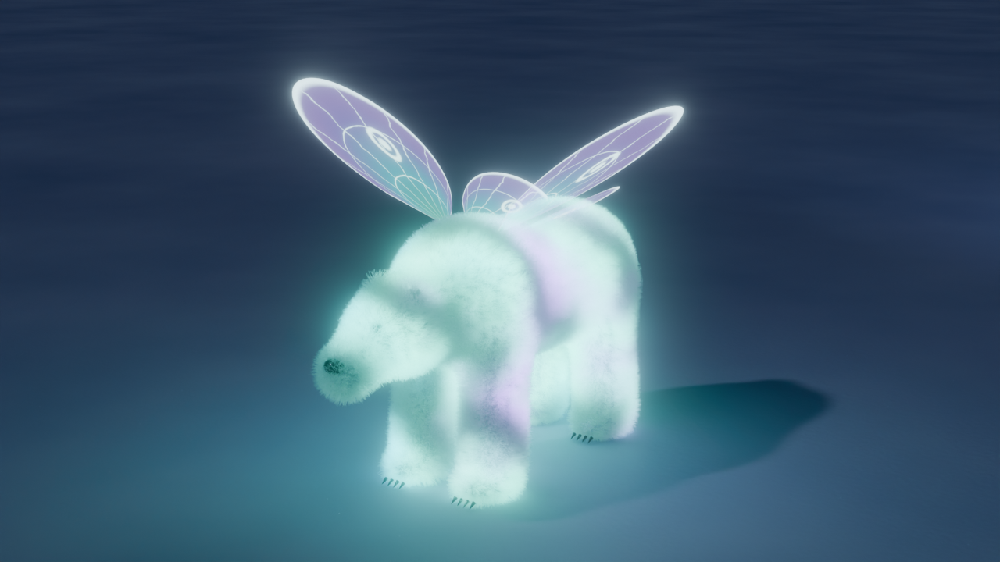

Orso polare massiccio con **vero pelo** che fa da fibra ottica: onde di luce
verde, ciano e viola scorrono sul corpo (rampa colori animata con i driver +
bordo Fresnel) e sui peli la luce cresce verso la punta, come in una fibra.
Sulla schiena, due paia di ali da falena di pura luce boreale.

### 02 · Pinguino-Cristallo
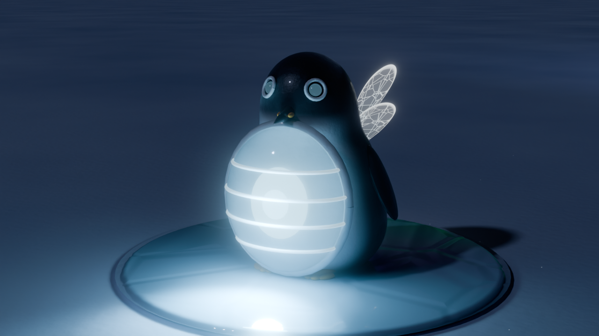

Pinguino tozzo con la pancia trasformata in un **bulbo di vetro spesso**
incastonato nel piumaggio (miscela di Glass BSDF ed Emission, con i segmenti
dell'addome di lucciola), che illumina di azzurro la lastra di ghiaccio su cui
sta per scivolare. Piccole ali da insetto brinate.

### 03 · Renna-Cometa
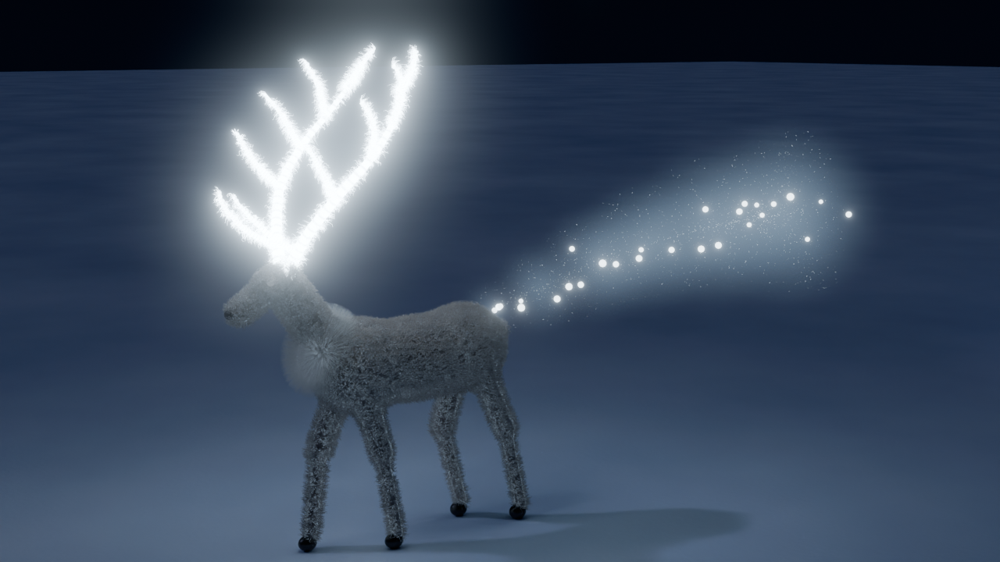

Renna slanciata, al passo. Le corna sono **colossali antenne d'insetto** ad
anelli, coperte di minuscoli peli sensoriali (sistema particellare) e
accecanti di luce bianco-azzurra. Dietro di sé lascia una **scia di neve
luminosa** come la coda di una cometa: migliaia di granelli (particelle che
scintillano ognuna col suo ritmo) in un alone volumetrico.

### 04 · Volpe-Ghiacciaio
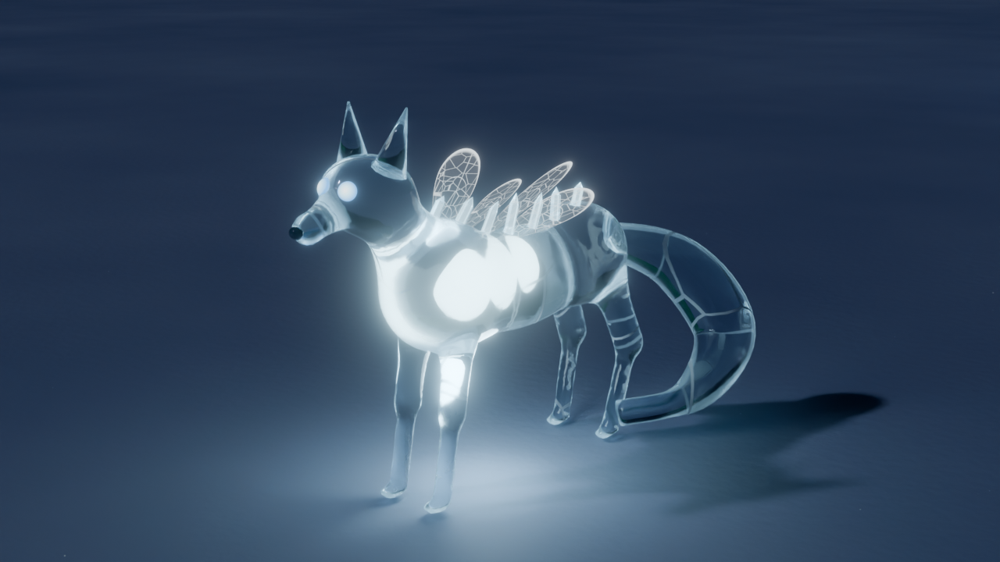

Volpe artica snella scolpita nel **ghiaccio purissimo**: Transmission con
Roughness variabile e sottili crepe bianche all'interno. Nel petto si vede
battere il **cuore di luce fredda**, a segmenti come una lanterna di lucciola.
Punte di ghiaccio sulla schiena e minuscole ali da libellula ghiacciate.

### 05 · Leopardo-Valanga
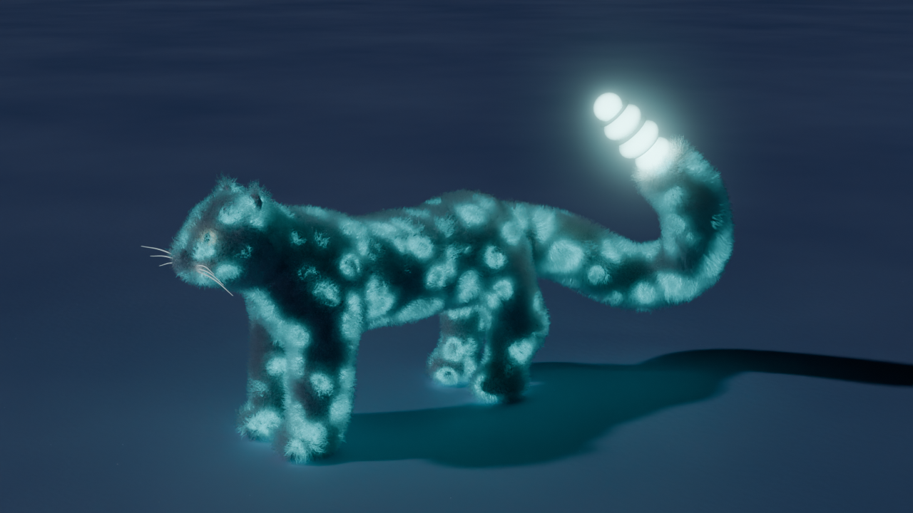

Leopardo delle nevi possente con il pelo folto: le **rosette** sono chiazze di
scaglie d'insetto che emettono luce **ciano** e che si vedono brillare
attraverso la pelliccia (più forte alla radice dei peli). La coda, lunghissima
e spessa, finisce in un **bulbo di lucciola** luminoso.

### 06 · Falena-Yeti
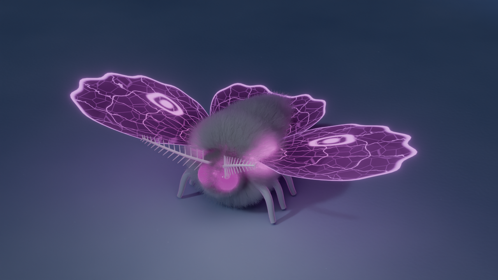

Falena gigantesca e soffice, coperta da una **pelliccia bianca lunga e
arruffata**. Sotto, il corpo e le enormi ali carnose pulsano di **magenta**:
la luce filtra attraverso il pelo (emissione alla radice di ogni pelo + un
guscio di Volume Scatter illuminato da dentro). Antenne piumate enormi.

### 07 · Civetta-Bufera
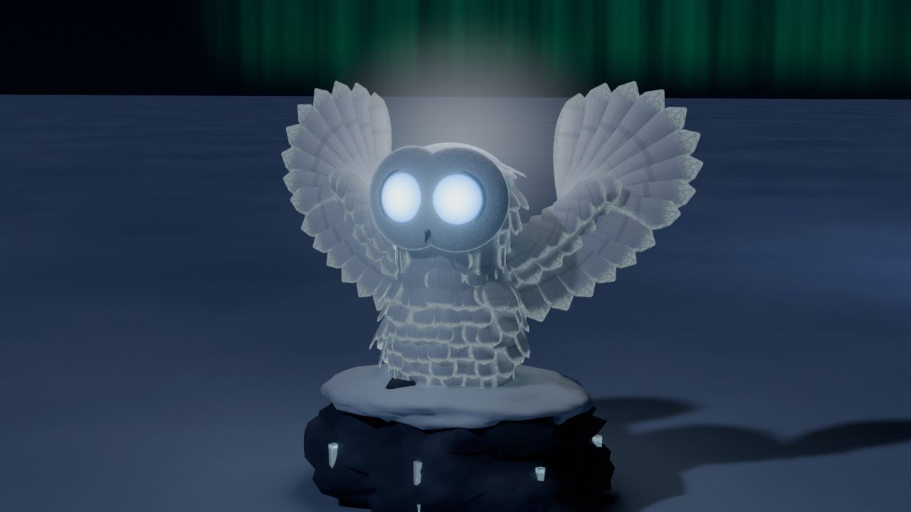

Civetta delle nevi fiera su una roccia innevata con i ghiaccioli. Ogni **piuma
è modellata** ed è bordata di **cristalli di ghiaccio luminosi**: l'emissione è
limitata ai bordi e alla punta della piuma (maschera dalle UV + Fresnel). Le
ali aperte si sollevano e, quando sono del tutto aperte, rilasciano un **lampo
di luce bianca**. Gli occhi sono due fari azzurri che proiettano luce.

### 08 · Il Pupazzo di Neve "Skibidi" (The Brainrot Snow Moth)
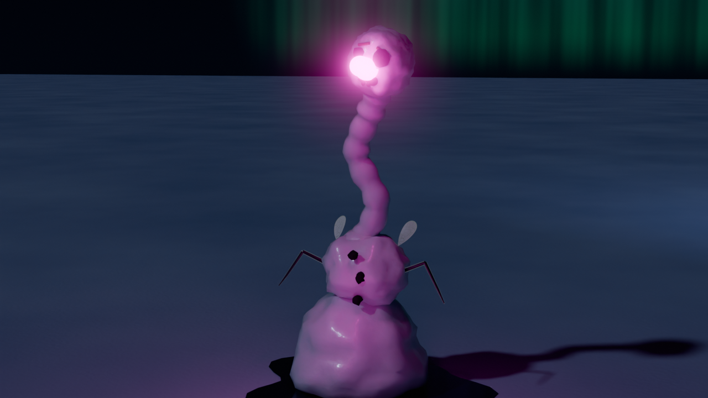

Pupazzo sbilenco di **neve bagnata e mezza sciolta** (palle irregolari che si
afflosciano in una pozzanghera, gocce che colano) con un **collo
assurdamente lungo e flessibile** che ondeggia. Al posto della carota, una
gigantesca **lampadina LED da gaming** che scorre su tutti i colori
dell'arcobaleno a velocità fastidiosa (nodo Hue/Saturation guidato da
`#frame`), insieme alla sua luce. Ai lati, due misere zampette e alucce da
mosca congelate.

## Serie 4 · Creature luminose dell'oceano

Generate da [`blender/creature_oceano.py`](blender/creature_oceano.py), su un
fondale sabbioso con le **caustiche** che si muovono, luce che scende dalla
superficie, **foschia azzurra** (volume) e plancton sospeso.

### 01 · Medusa-Lanterna
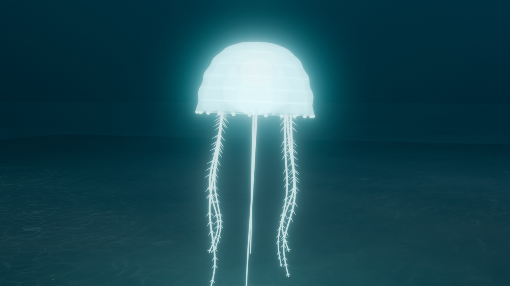

L'ombrella è modellata come il grande **addome segmentato di una lucciola**:
gelatinosa e semitrasparente (subsurface), piena di **gas luminoso ciano** e
con una lanterna al centro. Respira contraendosi e galleggia. Al posto dei
tentacoli pendono lunghe **antenne piumate da falena** che ondeggiano.

### 02 · Cavalluccio-Neon
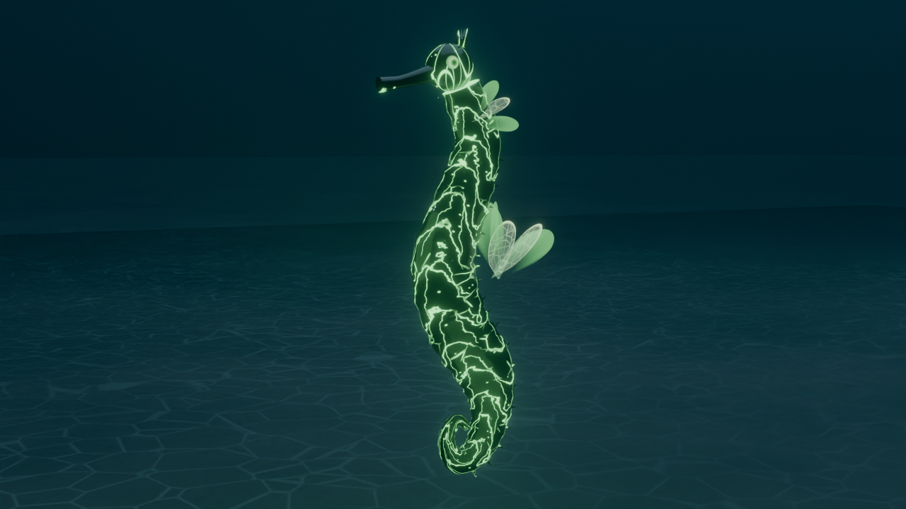

Cavalluccio marino quasi nero coperto di **pattern tribali naturali verde
neon** (onde, spirali e reticoli disegnati sulle UV del corpo). Le pinne sono
piccole **ali da insetto frenetiche** con la loro **scia luminosa**.

### 03 · Granchio-Faro
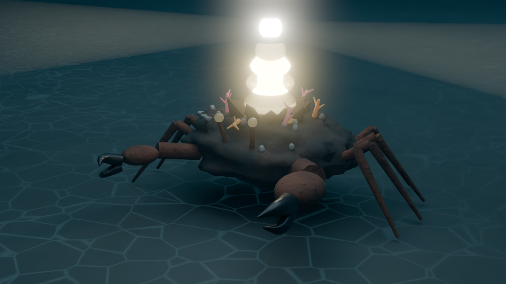

Granchio con una corazza di **roccia viva** (ruvidissima, con rilievo forte)
incrostata di coralli e balani. Dal centro spaccato del carapace esce un
massiccio **bulbo di lucciola** liscio e vitreo con in cima una lanterna che
**ruota** come quella di un faro, con due fasci di luce volumetrici.

### 04 · Manta-Luminescente
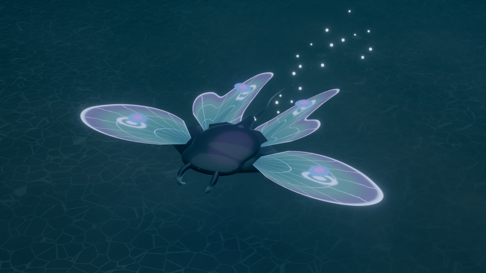

Manta maestosa con le pinne pettorali modellate come le ali di una
gigantesca **falena luna** (con le lunghe code), venature blu e **ocelli che
pulsano di blu cobalto e viola**. Plana ondeggiando e lascia dietro di sé una
scia di **plancton luminoso**.

### 05 · Squalo-Plasma
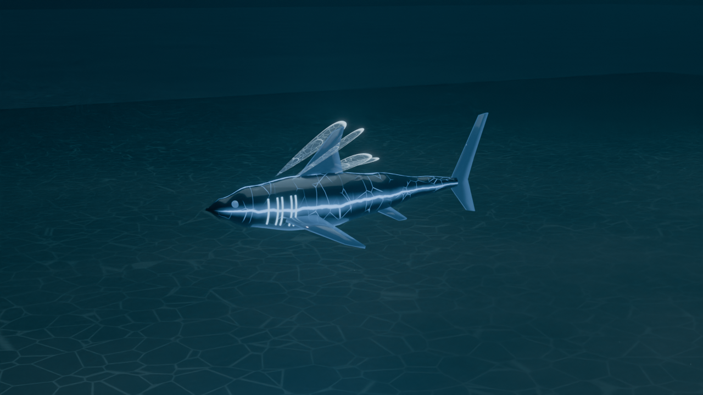

Squaletto idrodinamico dalla pelle scura e bagnata (clearcoat alto). Sotto la
pelle si vede il **sistema circolatorio** che brilla di azzurro-plasma (maschera
emissiva molto definita). Branchie luminose e **quattro sottili ali da
libellula** cariche di energia.

### 06 · Tartaruga-Fosforica
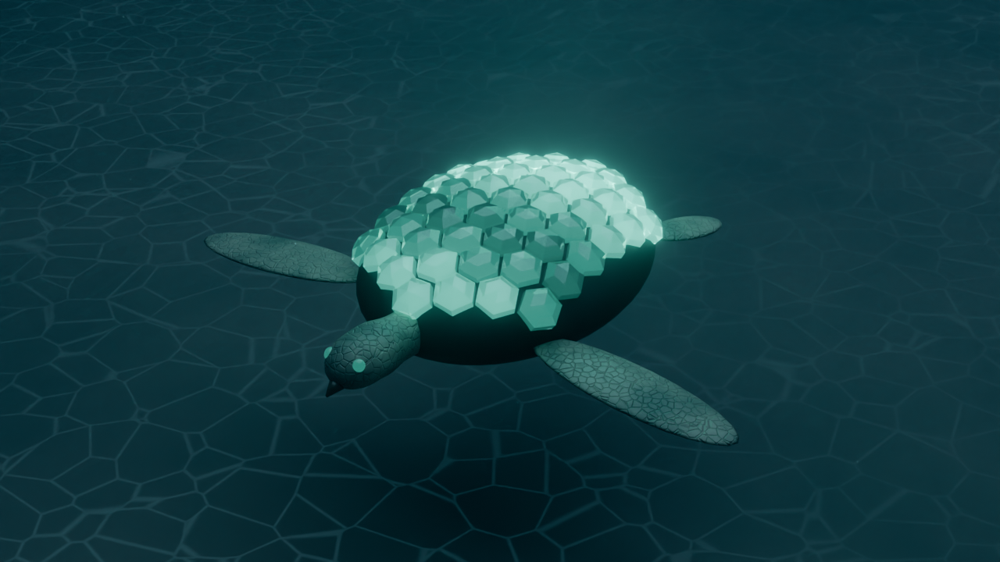

Tartaruga marina con il guscio fatto di **decine di bulbi esagonali**
(modellati uno per uno sulla cupola): celle di vetro spesso piene di liquido
verdeacqua che pulsano ognuna per conto suo, formando **onde di luce** dalla
testa alla coda. Nuota muovendo le pinne.

### 07 · Rana Pescatrice-Abisso
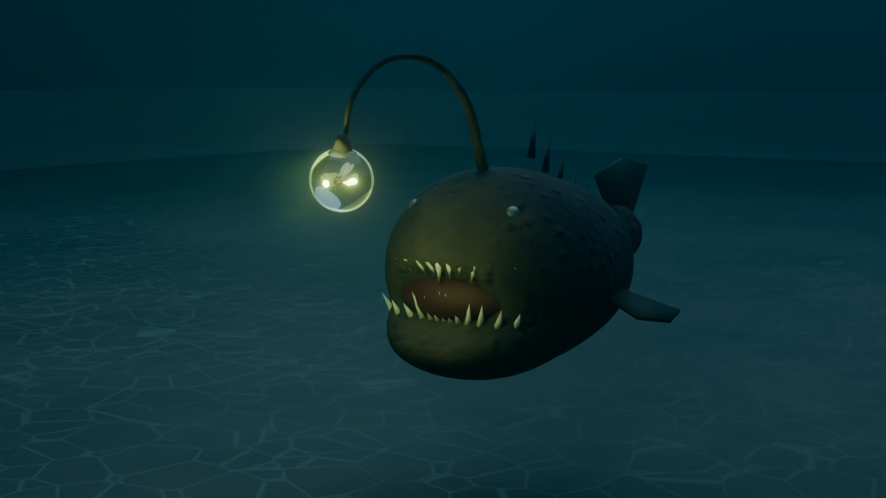

Pesce degli abissi scuro, opaco e verrucoso, con la bocca spalancata piena di
denti ad ago. L'esca è una sfera di **vetro organico** con dentro una
**minuscola lucciola completa** (zampette, elitre, antenne, lanterna
luminosissima) che **sbatte le ali disperatamente**.

### 08 · Il Blobfish "Mewing" (The Brainrot Ocean Moth)
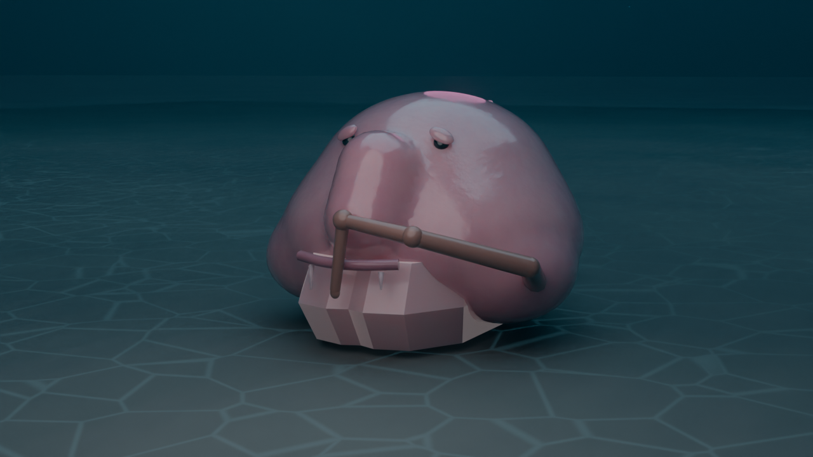

Blobfish rosa, molle e cadente (subsurface e alta specularità), con il nasone
che pende e gli occhietti apatici… e una **mascella squadrata iper-definita**
da "gigachad" (spigoli vivi, fossetta sul mento). Una zampetta da insetto è
premuta sulle labbra per fare **"shhh"**, e sulla schiena due alucce
microscopiche emettono un bagliore rosa **debole e patetico**.

## Serie 5 · I mostri

Generati da [`blender/creature_mostri.py`](blender/creature_mostri.py).
Come le tre serie che seguono sono **solo modelli 3D, senza animazioni**, con
il setup EEVEE Next descritto più sotto ([Setup EEVEE](#setup-eevee-next-serie-5-8)).
Scena: terreno scuro da cimitero, foschia viola e luna.

### 01 · Pipistrello-Sanguisuga
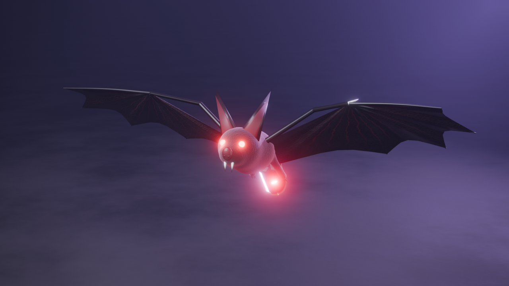

Pipistrello nero dal pelo folto, con grandi orecchie a punta, zanne e occhi
cremisi. Le ali sono membrane coriacee tese tra le dita, con le venature e
la luce che le attraversa. Al posto dell'addome ha una **fiala medica di
vetro** con la ghiera di metallo, piena di **sangue luminoso**: la superficie è
un Glass BSDF e dentro ci sono un denso **Volume Absorption rosso** e
un'emissione di volume cremisi.

### 02 · Franken-Scarabeo
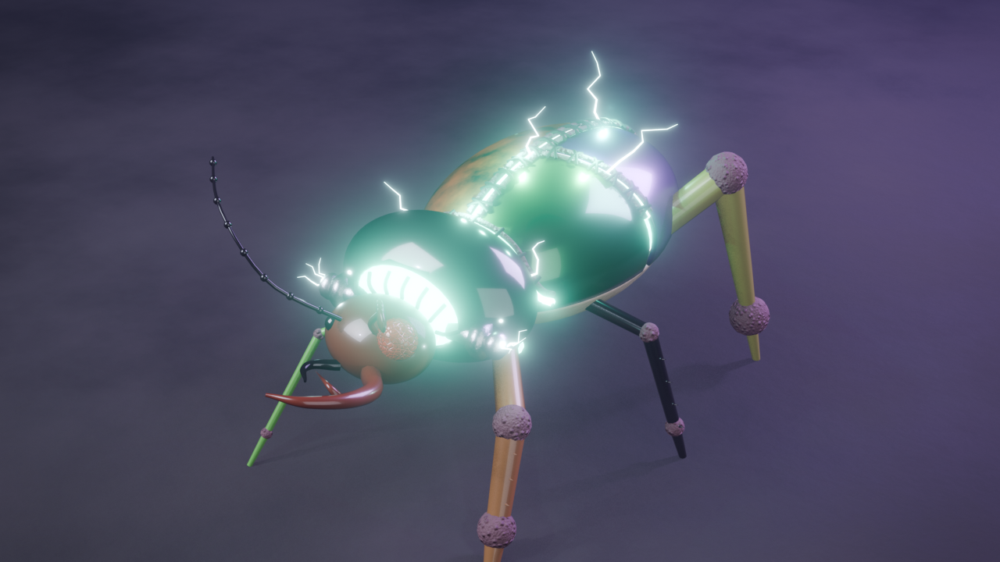

Coleottero fatto di **pezzi di insetti diversi cuciti insieme**: un'elitra
smeraldo metallica e una viola, l'altra da coccinella, il pronoto nero di un
cervo volante, sei zampe diverse (talpa, mantide, cavalletta…), una mandibola
enorme e una piccola, un occhio di mosca e uno nero. Le **cicatrici** hanno il
rilievo (bump) e i punti di sutura a X. La luce verde-ciano **esce solo dalle
fessure** tra i pezzi, con qualche scarica elettrica. Alla base della testa ci
sono **due bulloni di metallo** che fanno scintille.

### 03 · Gargoyle-Ossidiana
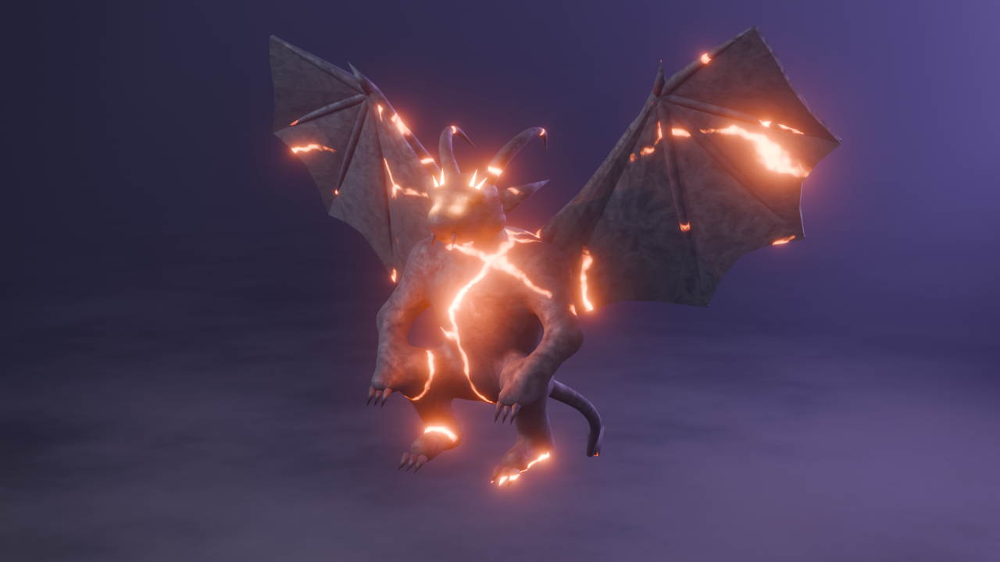

Demonietto di **pietra lavica** accovacciato in volo, con corna da ariete,
artigli, coda a picca e pesanti **ali di pietra**. La pietra è scura, molto
ruvida e metallica. Le **fratture** sono scavate con il nodo **Displacement** e
riempite di **magma incandescente** (Blackbody). Gli occhi sono di **pura
fiamma**.

### 04 · Zucca-Infestata (Jack-o'-Lantern Moth)
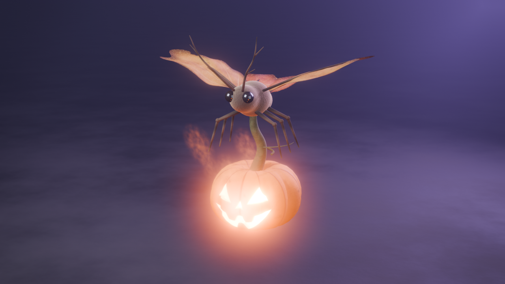

Falena pelosa con l'addome sostituito da una **zucca di Halloween deforme**,
appesa al torace per il gambo. Il **volto spaventoso è intagliato davvero**
(buchi booleani nel guscio della zucca), con una candela dentro che spara
luce arancione fuori da occhi e bocca, più un **fumo luminoso volumetrico**
che ne esce. Le ali sono **foglie autunnali morte** (bucate, con nervature e
un rametto), le zampe e le antenne sono **rametti secchi**.

### 05 · Corvo-Peste
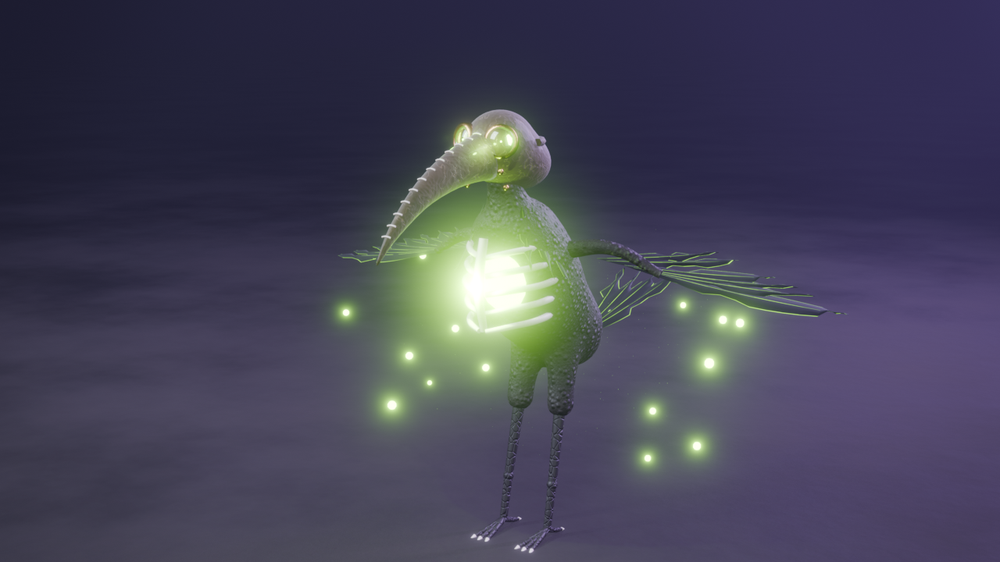

Corvo scheletrico e spennato (resta solo un collare di piume nere
arruffate), con le costole scoperte, che indossa una
**maschera da medico della peste** in cuoio logoro (becco lungo cucito,
borchie, cinghia). Dietro le **lenti di vetro** con la montatura d'ottone
brucia una luce **verde acida**, e anche dal petto scarno. Le ali sono di
**piume nere strappate** con i bordi tossici, e intorno galleggia una
**polvere luminosa**.

### 06 · Occhio-Fluttuante (Watcher's Eye)
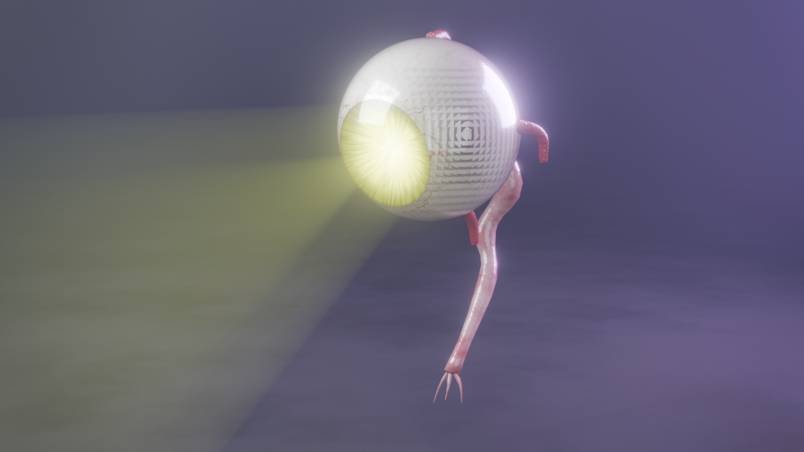

Un gigantesco **bulbo oculare bagnato e iniettato di sangue** (sclera lucida
con i capillari) che levita a mezz'aria, con il **nervo ottico** che pende come
una coda e i muscoli recisi. L'**iride è concava** e fa da lampadina: proietta
un **cono di luce volumetrica giallo-malattia** con un faretto, come un faro da
prigione.

### 07 · Calderone-Animato
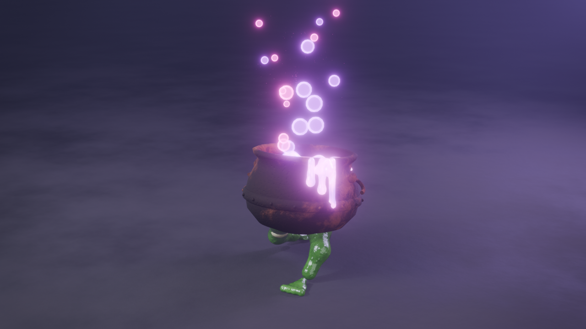

Piccolo **calderone di ghisa arrugginita** (fascia, rivetti, maniglie) che corre
su due tozze **zampe di rana**. Dentro ribolle una **pozione viola** con
Subsurface estremo ed emissione, che trabocca e cola. In aria salgono **bolle
luminose fucsia e viola** trasparenti (Alpha Blend), in parte mesh e in parte
particelle.

### 08 · Il Verme dell'Ohio "Nextbot" (The Brainrot Monster Moth)
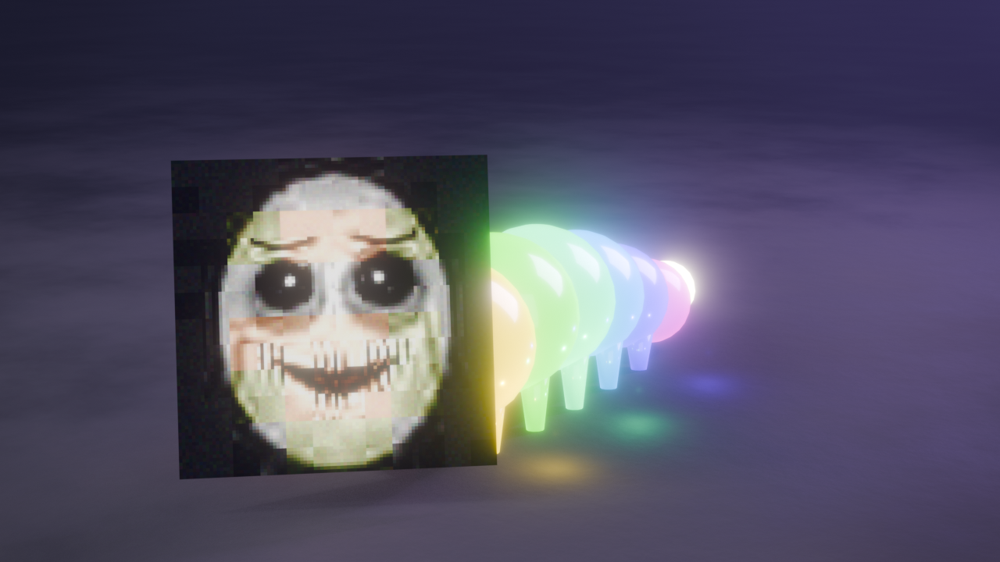

Bruco-lucciola cicciotto a segmenti che **brillano in RGB**, con la coda a
lanterna. Al posto della faccia ha un **piano 2D completamente piatto** con una
faccia meme inquietante, **compressa in JPEG e sgranata**. La faccia è
disegnata dallo script (non è una foto) ed è impacchettata nel `.blend`. Un
vincolo **Track To** la fa guardare **sempre verso la camera**.

## Serie 6 · Creature luminose dell'inferno

Generate da [`blender/creature_inferno.py`](blender/creature_inferno.py).
Setup dell'inferno: AgX **High Contrast**, esposizione −0.7, Bloom 0.5 e
vignettatura. Chitina con Roughness 0.4 e Coat 0.4, ali con Alpha 0.2.

### 01 · Cerbero Piccino, il Guardiano a Tre Teste
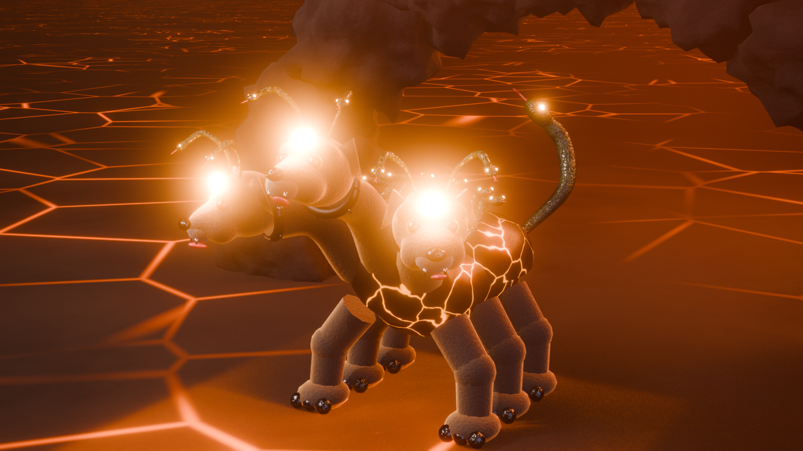

Un solo torace da coleottero con **tre testine di cagnolone** su tre colli: è
la stessa testa **istanziata tre volte**, con collare borchiato e lingua. Su
ogni fronte c'è un **faro ambra 2400 K**, gli occhi hanno il bordo che brilla
con il Fresnel. Le **antenne sono serpentelli**, così come la criniera attorno
ai colli e la testina in fondo alla coda. Le sei zampe sono tozze, da
cagnone. Nella sua scena c'è un **portale di roccia** con la luce arancio dal
basso.

### 02 · Caronte Barchetta, il Traghettatore
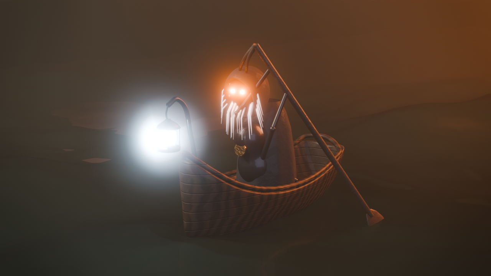

L'addome è una **barchetta di legno** con la prua a punta (sezioni a U più
Solidify). Il corpo è coperto da un **cappuccio-mantello** (le elitre) da cui
spuntano la barba e i capelli bianchi. Nel buio del cappuccio brillano due
**occhi di brace** (1800 K). Le antenne si fondono in un **remo lungo**, e
sul petto c'è l'**obolo d'oro**. Sulla prua c'è una **lanterna fantasma**
azzurro-verde (9500 K) con un alone di Volume Scatter. Nella sua scena
galleggia sul fiume (**Ocean Modifier**) nella nebbia.

### 03 · Ade Ombretta, il Signore dell'Ombra
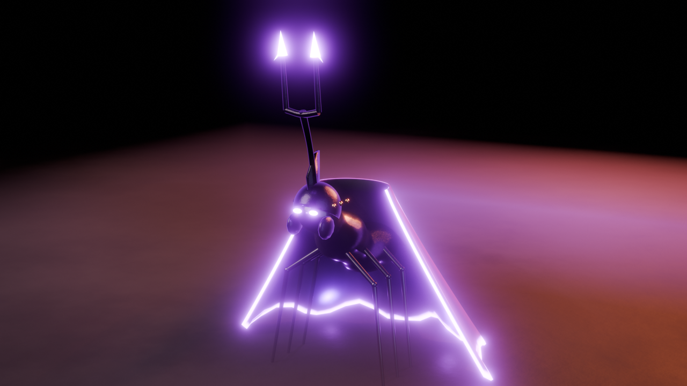

Insetto nero con l'**elmo dell'oscurità** (cresta, paraguance, fessura degli
occhi viola) e le **antenne a bidente** con le punte uncinate luminose. Le
elitre si allargano in un grande **mantello** che scende fino a terra.
L'emissione viola (0.5, 0.1, 1.0) sta **solo sul bordo**, con il Layer Weight
come fattore. Nel materiale c'è già il mix con il Transparent BSDF per
l'invisibilità: basta il valore *Visibilità*. Sul fermaglio c'è una gemma.

### 04 · Persefone Melagrana, la Regina d'Autunno
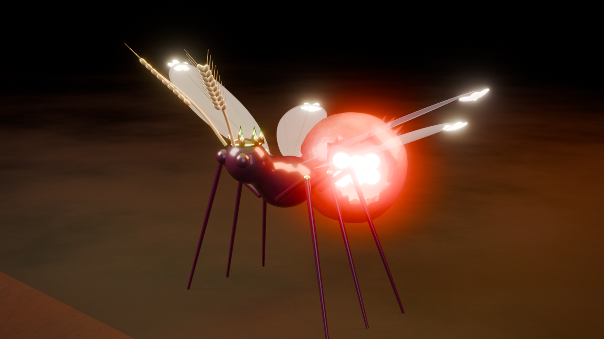

Insetto snello color prugna con un diadema d'oro. L'addome è una
**melagrana** con la corona a punta, spaccata su un fianco: dentro si vedono
l'albedo bianco e **sei semi rubino** con Subsurface ed emissione. Il loro
colore passa da un Color Ramp con il valore *Stagione* (0 = rubino 2000 K
sottoterra, 1 = verde 5500 K di primavera). Le antenne sono **spighe di
grano**, le ali sottili hanno dei **fiorellini alle punte**. Nella sua scena la
luce è rossa da sotto e verde da sopra.

### 05 · Alichino Arlecchino, il Diavoletto Burlone
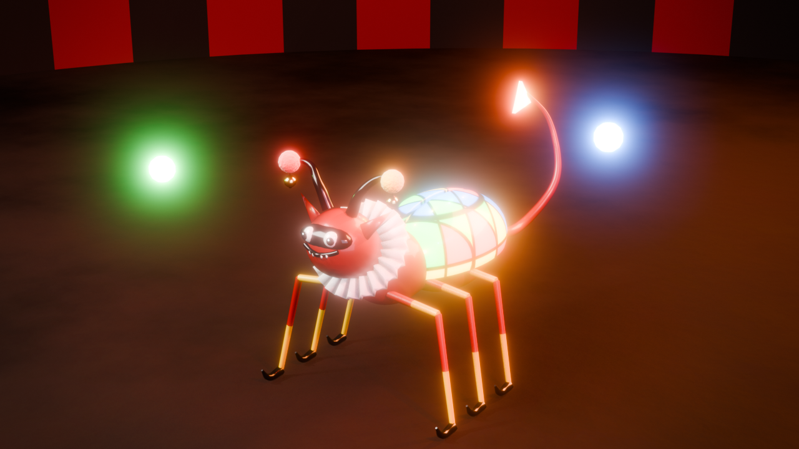

Diavoletto rosso con la mascherina nera, gli occhioni furbi, il sorriso a
denti in fuori e la **gorgiera pieghettata**. Le elitre hanno i **rombi da
Arlecchino** accesi (Voronoi regolare ruotato di 45°, un colore a caso per
rombo: rosso, giallo, verde, blu), i cornetti portano **pompon e campanellini
d'oro**, e la coda finisce a **punta di freccia** luminosa. Ha le calze a righe
e, accanto, **due false luci-esca**. Nella sua scena c'è il tendone da circo.

### 06 · Ghiacciolo, il Re di Ghiaccio (Cocito)
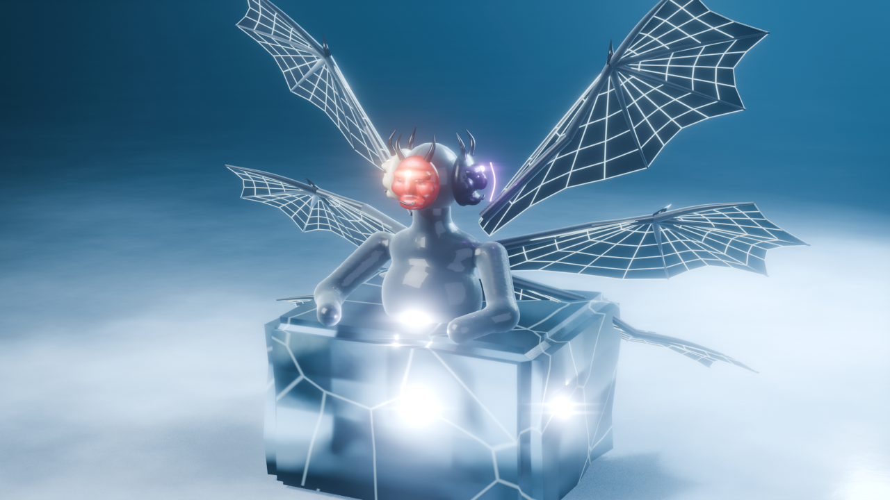

Il Lucifero di Dante in versione insetto, **prigioniero fino al petto in un
blocco di ghiaccio** (Bevel e Displace, Transmission 1, IOR 1.31, Volume
Absorption ciano). La testa ha **tre facce**, rossa, giallo-bianca e nera,
ognuna con il suo puntino luminoso (2200 K, 4500 K e viola). Sotto le facce
ci sono **sei ali da pipistrello** con una rete di brina (Wireframe). Il
**cuore ciano (12000 K)** brilla dentro il ghiaccio.

### 07 · Flegetonte Scintilla, il Fiume di Fuoco
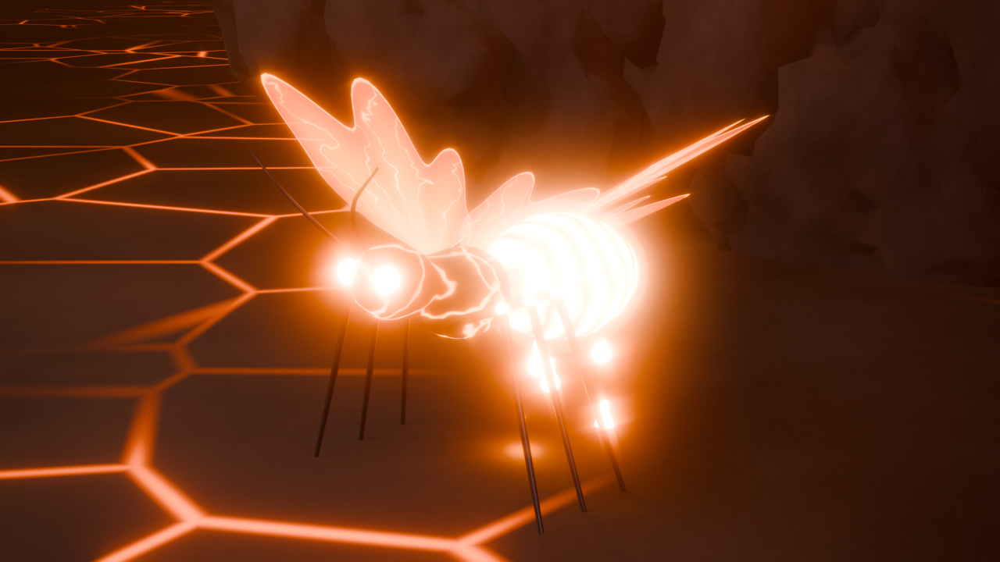

L'addome è una **lampada lava** a goccia: guscio di vetro leggero, fuoco che
scorre dentro (Noise + Wave lungo l'asse, rampa da 1700 K a un nucleo di
3800 K) e bolle di lava. Le ali sono **lingue di fiamma** e dal ventre cadono
**gocce di lava**. Torace e testa sono di roccia vulcanica con le crepe.

### 08 · Tung Tung Tung Sahur Infernale, il Tronco Arrabbiato
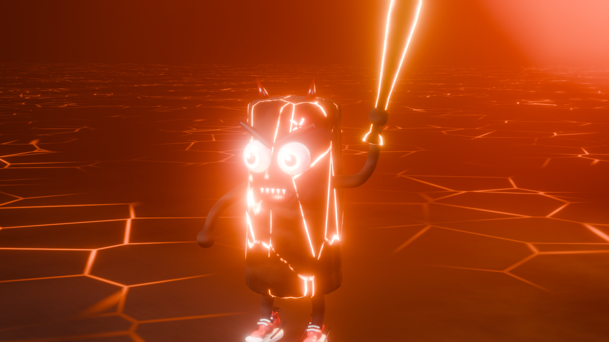

**Tronco carbonizzato** con la corteccia nera e le **crepe di lava** (Voronoi
come maschera dell'emissione, Blackbody 1600 K). Ha gli **occhioni da cartone
rossi**, le sopracciglia inclinate e rabbiose, la **vena della rabbia** sulla
fronte, i cornetti e la bocca coi denti. Alza una **mazza rovente** (rampa
nero → rosso → giallo sui bordi), porta le **sneakers rosse** e ha due alucce
da lucciola quasi nascoste. Nella sua scena c'è la nebbia rossa con le braci.

## Serie 7 · Gli angeli

Generati da [`blender/creature_angeli.py`](blender/creature_angeli.py).
Setup: AgX **Medium High Contrast**, esposizione −0.5, Bloom 0.4. Chitina con
Roughness 0.35 e Coat 0.5, ali Blended con **Thin Film ~400 nm** e Alpha 0.15.

### 01 · Fiammella, il Serafino
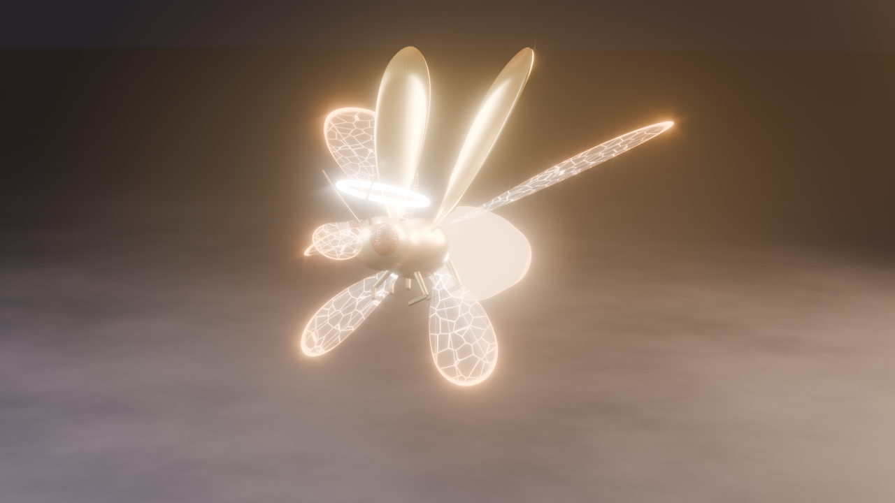

**Sei ali**: le elitre sono aperte e non coprono niente, due ali membranose
si piegano **davanti agli occhi** (come a nascondino) e due coprono le zampe
ripiegate. Più un paio d'ali per volare. L'**addome a goccia** (Displace
leggero) brilla di bianco-oro 5500 K con i bordi arancio 2600 K, dentro un
alone volumetrico dorato. Le nervature delle ali sono Voronoi (Distance to
Edge) con emissione 25. Attorno al capo c'è un piccolo **nimbo**.

### 02 · Quattro Musetti, il Cherubino
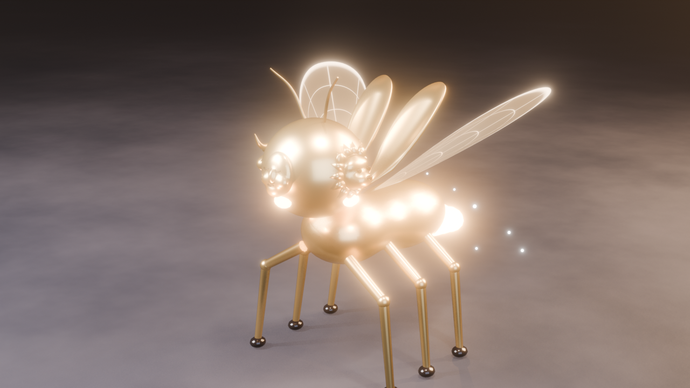

Il pronoto è una cupola di **elettro** (Metallic 0.8, Anisotropic 0.5) con
**quattro facce scolpite**: davanti un profilo umano dolce con gli occhi
chiusi, a destra un leoncino con la criniera, a sinistra un bue con le corna,
dietro un'aquila col becco. Sotto ogni faccia c'è un **organo luminoso ambra
3200 K**, e c'è anche il lanternino addominale con le scintille bianche. Ha
elitre, ali doppie e **zampette con gli zoccoli tondi**.

### 03 · Ruotina, l'Ofanim
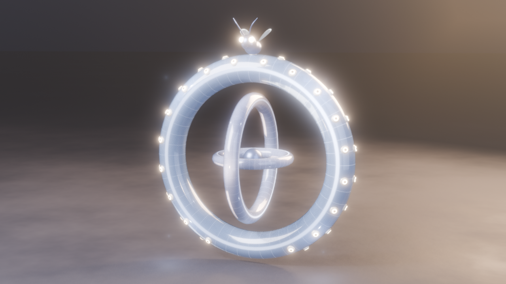

**Ruote dentro ruote**: il corpo è un anello di chitina cristallina, con dentro
altri due anelli perpendicolari e il mozzo. Sul cerchione ci sono **decine di
ocelli** bianco-oro (istanze dello stesso occhio). Gli anelli hanno scanalature
luminose blu 9000 K e un'onda di luce più intensa. In cima c'è una testina
con le **ali quasi vestigiali**. Nella sua scena la camera ha la **profondità di
campo f/2.8**.

### 04 · Scudo Stellato, l'Arcangelo Michele
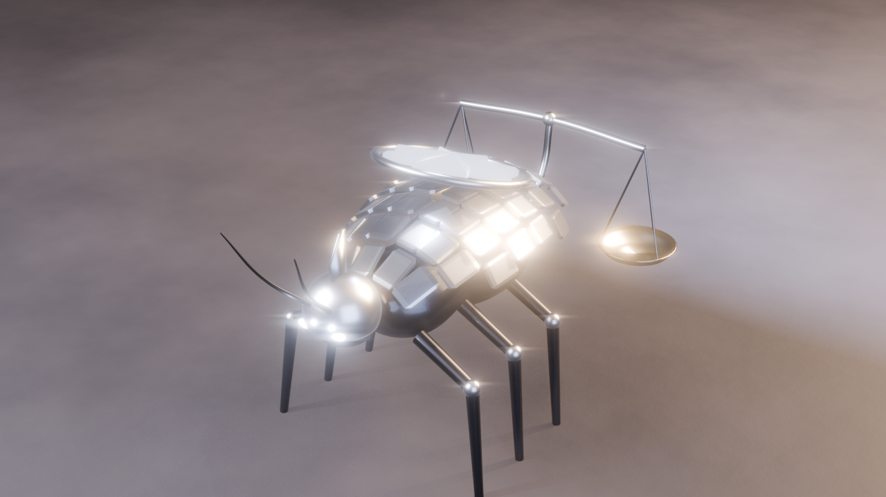

Scarabeo con le elitre coperte da **placche d'armatura sovrapposte** (Metallic
0.9, Roughness 0.2, bordi che si accendono di bianco-acciaio 8500 K). Sul
dorso porta uno **scudo a stella a otto punte** (Emission 120, bordo più
chiaro con il Fresnel), l'elmo con la cresta e, dietro, una **bilancia** con i
due piatti in perfetto equilibrio. Streaks orizzontale nella sua scena.

### 05 · Trombettina, l'Arcangelo Gabriele
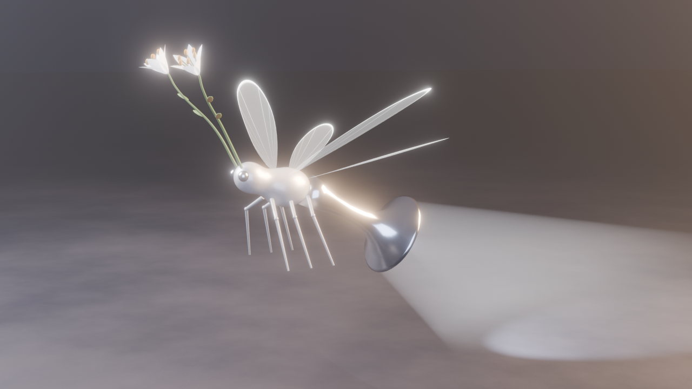

Insetto bianco perla con le **antenne a stelo di giglio** (foglie, sei petali,
stami). L'**addome si apre in una campana di tromba** d'argento che
proietta un **cono di luce lunare** (7500 K, tinta lattea): la campana ha
l'emissione dentro, poi ci sono un cono volumetrico e un faretto. Le ali sono
lunghe, sottili e quasi bianche. Sfondo blu notte.

### 06 · Dottor Smeraldo, l'Arcangelo Raffaele
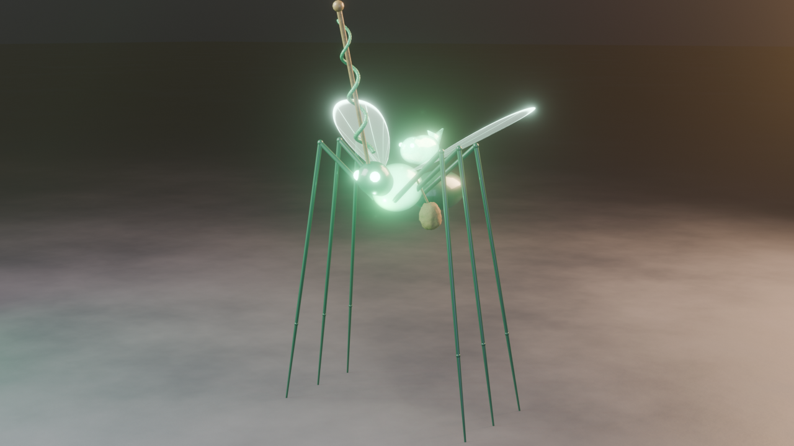

Viandante dalle **zampe lunghissime**. Le antenne sono il **bastone del
pellegrino con un serpentello avvolto a spirale** (elica). Sul dorso porta una
**sacca a forma di pesce** traslucida, e il torace ha Subsurface verde e
emissione smeraldo, come luce che filtra dalla carne. Ha la conchiglia del
pellegrino sul petto e una bisaccia.

### 07 · Lanternina, l'Angelo Custode
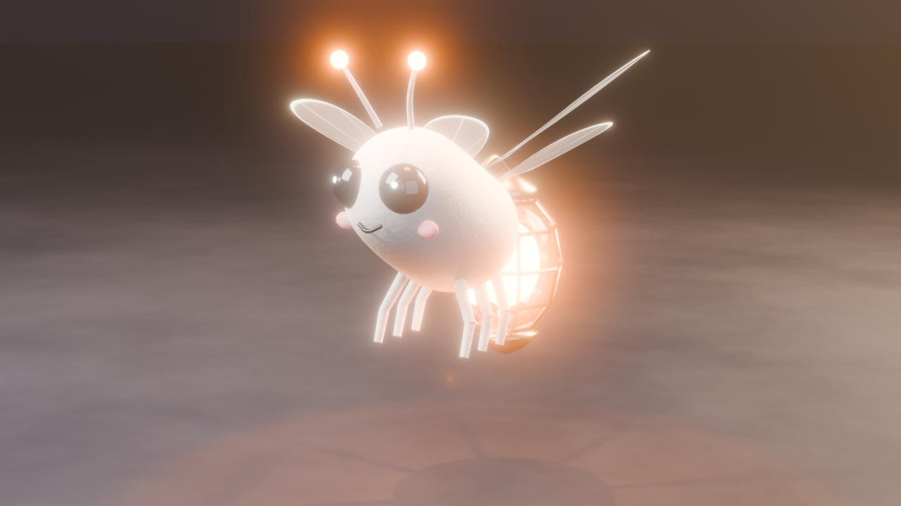

Cucciolo tondo e morbido con gli occhioni lucidi e le guance rosa. L'addome è
una **lanterna**: una gabbia di chitina dorata (sfera con **Wireframe**), il
vetro, e dentro una luce di candela 1900 K con un leggero Noise
sull'intensità. **Un'ala è più piccola e si china in avanti**, verso chi
protegge. Nella sua scena un faretto caldo illumina un piccolo cerchio di
pavimento.

### 08 · Halolo Halolà, il Lucciolo Musicante (brainrot)
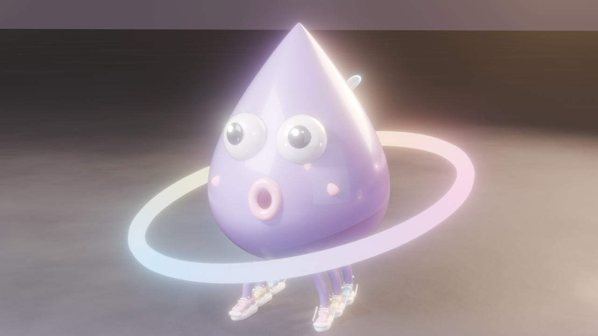

Corpo a goccia pastello, **occhi enormi da cartone**, bocca a "O" che canta e
guance rosa, su **tre paia di sneakers** (rosa, gialle, azzurre: la stessa
scarpa istanziata). Attorno all'addome gira come un hula-hoop un'**aureola
gigante** (toro Major 0.6, Minor 0.03) con la rampa rosa → giallo → azzurro e il
nucleo bianco. In fondo all'addome c'è un puntino bianco (Emission 120). Ha
due alette inutili. Sfondo pastello e luci da discoteca.

## Serie 8 · I draghi

Generati da [`blender/creature_draghi.py`](blender/creature_draghi.py), con
lo stesso setup degli angeli (scaglie con Thin Film). I corpi lunghi sono tubi
lungo una curva con le UV, e le squame sono procedurali: squame sovrapposte,
ventre a placche e, dove serve, luce.

### 01 · Tesorino, il Drago Custode (Fafnir)
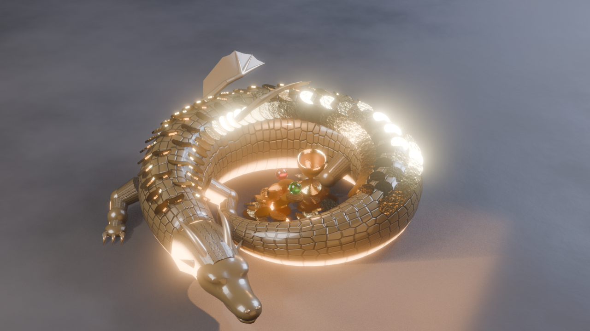

Drago tozzo **arrotolato come un gattone che dorme**, con gli occhi chiusi. Il
dorso è coperto di **scaglie a forma di monetina** (istanze di un cilindro
schiacciato). Il ventre a placche brilla d'oro 3000 K. La coda abbraccia una
**pila di monete** (Metallic 1) con un calice e due gemme, e sotto la coda
c'è un piccolo lanternino.

### 02 · Perla, il Drago Cinese Lóng
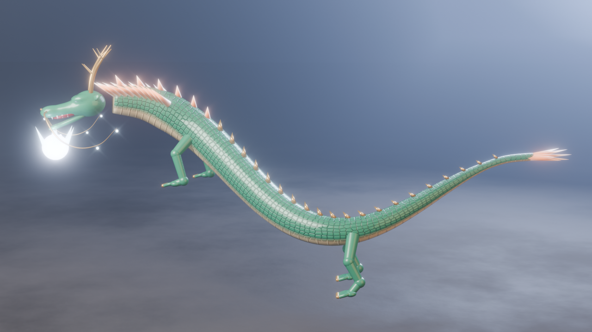

Corpo lungo e **sinuoso** color giada (Thin Film), con la cresta dorsale e il
ciuffo in coda. La testa è da cammello, con le **corna da cervo** ramificate, i
baffi lunghi, gli occhi rossi da coniglio e la criniera. Ha quattro zampe con
**cinque artigli tondi**. Sotto il mento galleggia la **perla fiammeggiante**
(nucleo acqua 9500 K, bordo bianco con il Fresnel, lingue di luce), e lungo i
baffi scendono **goccioline di luce**.

### 03 · Marea, il Re Drago Ryūjin
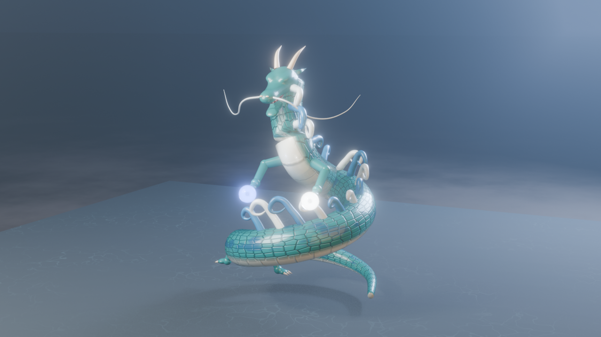

Drago del mare **avvolto a spirale** che si alza verso l'alto, con le squame
verde mare e una **criniera fatta di onde** che si arricciano (spuma e blu).
Ha tre artigli per zampa, e le zampe anteriori stringono i **due gioielli
delle maree**: Kanjū blu profondo 12000 K e Manjū bianco-schiuma 7000 K, con
un guscio di vetro IOR 1.3. Nella sua scena ci sono il Volume Scatter
azzurro e le caustiche sul fondale.

### 04 · Quetzal, il Serpente Piumato
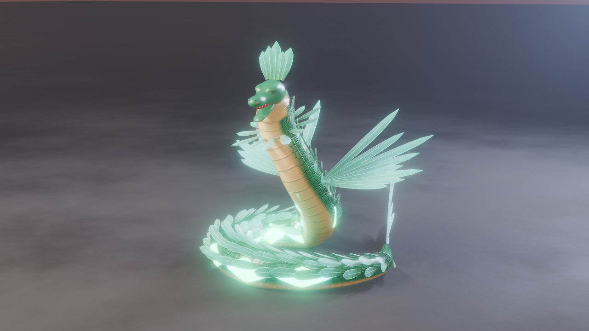

Serpente arrotolato che solleva il capo, **coperto di piume smeraldo**:
centinaia di istanze allineate al corpo, con iridescenza ed emissione sulle
punte. Ha una **coda a ventaglio** di lunghe penne, due **ali di piume**
aperte come un mantello, il collare e la cresta. Lungo i fianchi scendono
i **sette triangoli di luce** di Chichén Itzá. Nella sua scena c'è un'alba con
luce radente.

### 05 · Ddraig, il Drago Rosso Gallese
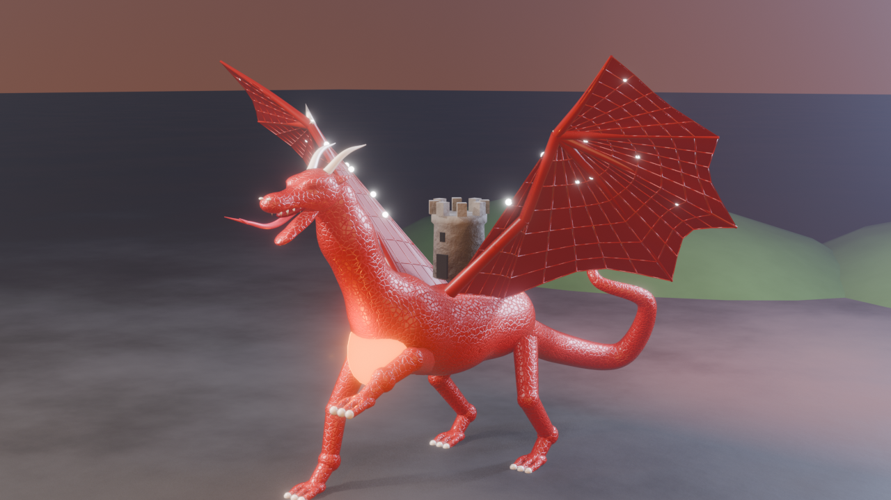

Il drago della bandiera del Galles in **posa araldica**, con una zampa
alzata, la lingua biforcuta e gli artigli tondi. Ha le **ali membranose**
alzate con la rete delle nervature (Wireframe) e i **puntini bianchi del
"fratello bianco"**. Petto e **punta della coda** brillano di rosso 2200 K, e
sul dorso porta la **torre di Vortigern** in pietra, con merli, porta e
finestra. Nella sua scena ci sono le colline al tramonto.

### 06 · Idra, la Piccola Idra di Lerna
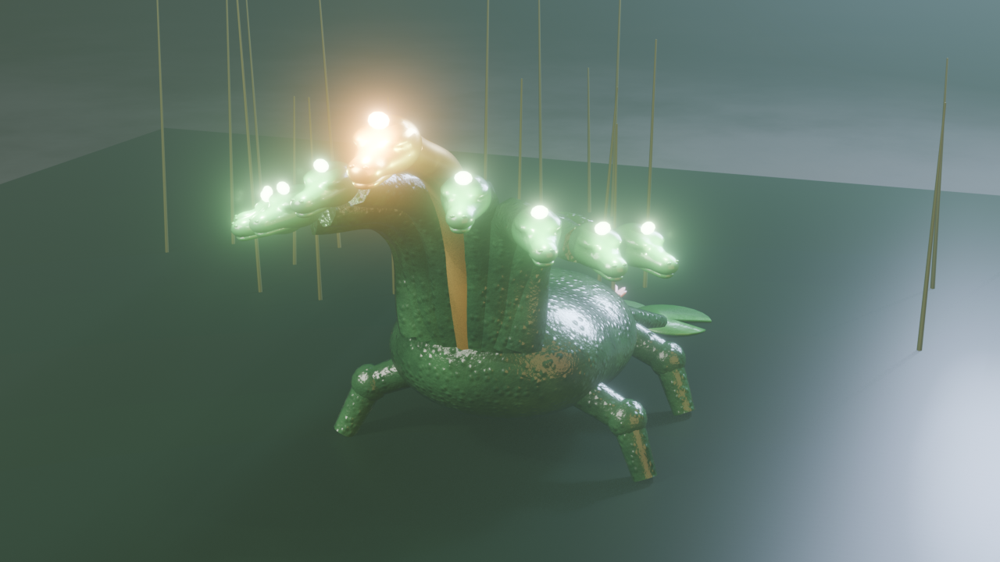

Corpo basso da palude con **nove testine su nove colli a ventaglio** (la
stessa testa istanziata). Quella centrale è più grande e **dorata**, con la
luce oro 3500 K, le altre hanno la luce verde-palude sulla fronte. Le **code
finiscono con foglie di ninfea** (una con il fiore) e le zampe sono palmate.
Nella sua scena ci sono l'acqua della palude, le canne e la nebbia verde.

### 07 · Blasone, il Wyvern Araldico
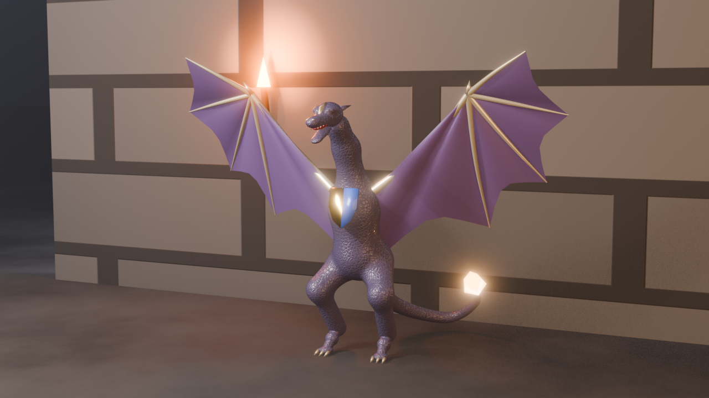

Wyvern ritto sulle **due zampe posteriori**, con le **ali al posto delle
braccia**, la cresta e uno **scudetto sul petto** partito d'oro e d'azzurro. La
coda finisce con una **punta di freccia** luminosa. Il suo colore viene da un
Color Ramp a 4 stop con gli smalti araldici (oro 3000 K, argento 8000 K,
rosso 2200 K, azzurro 12000 K) e si sceglie con il valore *Smalto*. Nella sua
scena c'è un muro di castello con una torcia.

### 08 · Ourobò Ourobò, il Ciambellino Draconico (brainrot)
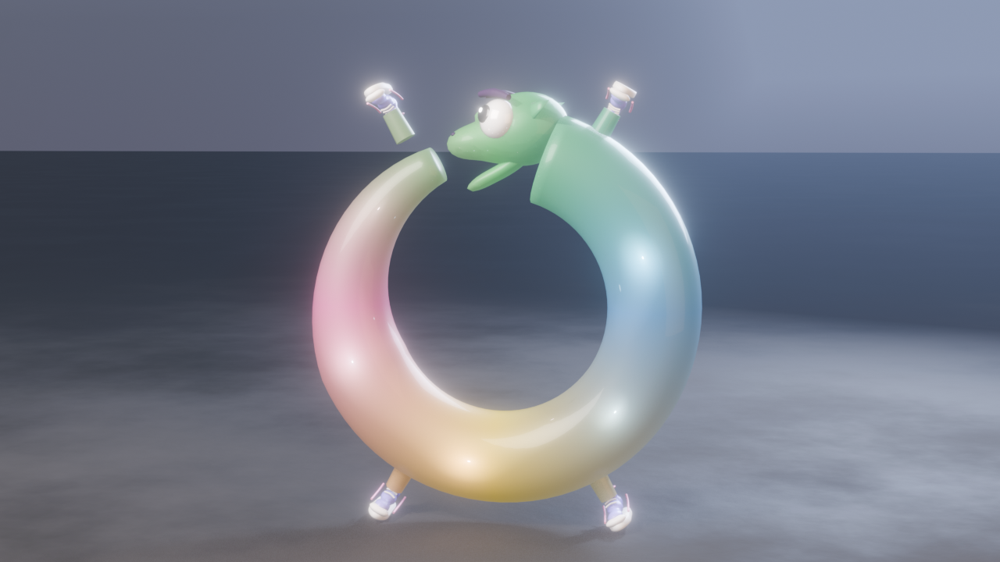

Drago a **ciambella perfetta** che si morde la coda: il corpo gira a cerchio e
si assottiglia fino a entrare nella bocca. Ha la testa da cartone con gli
occhioni e le sopracciglia, due alucce decorative e **quattro zampette con le
sneakers**, due a terra e due in aria, come una ruota. Tutto l'anello brilla
con il gradiente ciclico **rosa → giallo → azzurro → verde → rosa**, guidato
dall'angolo attorno al centro.

## Setup EEVEE Next (serie 5-8)

Le quattro serie nuove sono **modelli statici**: nessun driver, nessuna
animazione. Il setup di render è quello richiesto ed è in
[`blender/creature_strumenti.py`](blender/creature_strumenti.py), comune alle
quattro serie:

- **EEVEE Next** con Raytracing (Screen-Trace), Virtual Shadows e Light
  Threshold 0.001.
- **Volumetrie**: risoluzione 1:2, 96 step, distribuzione 0.8, ombre
  volumetriche attive.
- **Compositor**: Glare → Bloom (Threshold 1.0, Size 7), Glare → Streaks
  solo dove richiesto, e per l'inferno e i mostri una vignettatura leggera
  (Ellipse Mask + Blur).
- **Colore**: AgX con Look *High Contrast* ed esposizione −0.7 per l'inferno,
  *Medium High Contrast* ed esposizione −0.5 per angeli e draghi (i mostri
  usano −0.6).
- **Kelvin**: dove è indicata una temperatura il colore viene dal nodo
  **Blackbody**; le luci usano lo stesso colore, convertito in RGB.
- **Luci proxy**: ogni organo luminoso ha la sua emissione sulla mesh più una
  **Point Light (raggio 0.005 m) agganciata con un vincolo Child Of**, che lo
  segue se lo sposti. Su Roblox diventa Neon più una `PointLight`.
- **Luci limitate** (per non abbagliare): le emissioni sopra 10 vengono
  compresse (10 + un quarto dell'eccesso) e non superano mai 20, le luci proxy
  sono al 60% e le superfici grandi (addomi, anelli, scudi, aureole) hanno
  un'emissione bassa: brillano i bordi e gli organi piccoli, non tutto il corpo.
- **Istanze**: teste di Cerbero e dell'Idra, facce del Cherubino e di
  Ghiacciolo, sneakers, occhi dell'Ofanim, monete e scaglie di Tesorino e piume
  del Quetzal sono duplicati collegati della stessa mesh.

Nei titoli della richiesta "TEMA DRAGHI" e "TEMA ANGELI" erano invertiti
rispetto al contenuto: qui gli angeli sono Serafino…Halolo e i draghi
Tesorino…Ourobò.

## Dettagli tecnici

- **Emissione e trasparenza**: le ali usano un unico shader procedurale
  (`m_wing`) basato sulle UV del ventaglio (u = lungo il bordo, v = dalla base
  al bordo), quindi venature, bordi, celle, ocelli e puntini sono tutti
  regolabili da codice senza texture esterne.
- **Bagliore (bloom)**: un nodo *Glare* in compositing (e il bloom di EEVEE
  sulle versioni che lo hanno) fa "accendere" le parti luminose.
- **Animazioni**: sono fatte con driver semplici (`sin(frame)`), che Blender
  valuta anche senza abilitare l'esecuzione automatica degli script.
- **Compatibilità**: lo script è stato eseguito e renderizzato con
  **Blender 4.2 LTS** e **Blender 5.0**, in Cycles e in EEVEE. Le API che
  cambiano tra le versioni (nomi del Principled BSDF, EEVEE Next, compositor
  5.x) sono gestite. I file in `modelli/` sono salvati con la 4.2 e si aprono
  anche nella 5.0. Sulle versioni 3.x non è stato provato.
- **Prestazioni**: la scena `tutte` della prima serie ha 19 luci, ~300 piume e
  il pelo della Lucina; quella del deserto ha il pelo del fennec e le ali in
  vetro dell'avvoltoio; quella della neve ha il pelo di orso, renna, leopardo
  e falena-yeti; quella dell'oceano ha la foschia volumetrica (si spegne con
  `FOSCHIA = False` in cima a `creature_oceano.py`). In EEVEE restano fluide su
  una GPU recente. Se il viewport rallenta, nascondi le collezioni che non ti
  servono.
- **Particelle**: la scia della renna, il plancton della manta e quello
  sospeso nell'acqua sono sistemi particellari di tipo *hair* che istanziano
  un granello luminoso: sono fissi, quindi si vedono subito in ogni
  fotogramma senza bisogno di simulare.
- **Versione Roblox**: `esporta_roblox.py` ricostruisce ogni creatura con un
  livello di dettaglio più basso (`DETTAGLIO`) finché sta sotto i 20.000
  triangoli, cuoce i materiali in texture e genera lo script Luau. Le versioni
  Blender restano a dettaglio pieno.
